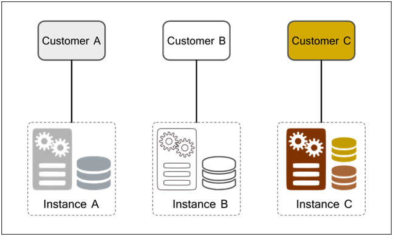

\ |STYLE0|\ 

.. _h53696678157c77362640467a3239:

Requisiti per la qualificazione di servizi SaaS per il Cloud della PA.
#######################################################################

.. _h695851784926e222894a475f396435:

Acronimi e definizioni
**********************

|REPLACE1|

Si richiamano inoltre i concetti e le definizioni relativi al \ |STYLE1|\  pubblicati dal National Institute of Standards and Technologies nel documento NIST Special Publication 800-145 “The NIST Definition of Cloud Computing”, in particolare con riferimento a:

* Platform as a service (PaaS), Infrastructure as a Service (IaaS)

* Private Cloud, Community Cloud, Public Cloud, Hybrid Cloud

* le cinque caratteristiche essenziali del Cloud computing: on-demand self-service, broad network access, resource pooling, rapid elasticity, measured service.

Per maggiori dettagli si veda: \ |LINK1|\ 

.. _h2f65316220271965446c384555203553:

Introduzione
************

Il presente documento allegato alla Circolare è stato redatto al fine di definire nel dettaglio i requisiti di cui all’art. 3 della Circolare che i CSP devono rispettare per ottenere la qualificazione AgID della propria soluzione SaaS. 

Come previsto dalla Circolare la procedura di qualificazione inizia mediante la richiesta del CSP interessato ad ottenere la qualificazione e prevede  verifiche amministrative e tecniche di cui il presente allegato fornisce modalità e specifiche.

Le soluzioni SaaS soggette a qualificazione riguardano applicativi software erogati secondo il paradigma SaaS e compatibili con una o più infrastrutture Cloud di tipo \ |STYLE2|\  o \ |STYLE3|\ . Dal punto di vista tecnico sono dunque individuati i seguenti soggetti che svolgono diversi ruoli durante e/o successivamente al processo di qualificazione:

* \ |STYLE4|\ , un CSP che eroga e amministra le risorse Cloud infrastrutturali di tipo IaaS e/o PaaS utilizzate dai servizi applicativi SaaS per l’erogazione del servizio e rispetto alle quali devono essere compatibili;

* \ |STYLE5|\ , un CSP che richiede la qualificazione della propria soluzione SaaS affinché sia disponibile all’acquisto da parte delle PA;

* \ |STYLE6|\ , PA che acquisisce e utilizza i servizi SaaS ed indirettamente le risorse IaaS e/o PaaS sottostanti erogate dal Fornitore Cloud.

E’ opportuno notare che le figure del Fornitore Cloud e del Fornitore SaaS possono in alcuni casi specifici coincidere con lo stesso soggetto.

Si intende, preliminarmente, fornire un quadro di riferimento riguardante le modalità di progettazione e realizzazione di una soluzione SaaS da parte dei CSP e il ciclo di vita di un servizio SaaS. Le definizioni del ciclo di vita e dei modelli di deployment che seguono sono altresì utili per contestualizzare e inquadrare i requisiti richiesti per la qualificazione delle soluzioni SaaS.

\ |STYLE7|\ 

Una soluzione SaaS prevede un tipico \ |STYLE8|\  attraverso attraverso  il quale viene resa disponibile agli utilizzatori (Acquirenti) da parte del Fornitore SaaS:

* \ |STYLE9|\ , ossia la predisposizione delle risorse Cloud infrastrutturali necessarie all’installazione ed erogazione della soluzione SaaS. Le attività di predisposizione sono eseguite a cura del Fornitore SaaS nell’ambito dell’infrastruttura Cloud messa a disposizione dal Fornitore Cloud. Tipicamente si tratta di risorse virtuali di tipo computazionale, di storage e di rete; più in generale possono essere comprese risorse di tipo IaaS e/o PaaS;

* \ |STYLE10|\ , fase in cui avviene da parte del Fornitore SaaS l’installazione e la configurazione dei moduli e componenti applicativi che costituiscono la soluzione SaaS;

* \ |STYLE11|\ , fase in cui la soluzione SaaS è fruibile da parte dell’Acquirente che è in grado di utilizzarla secondo quanto previsto contrattualmente;

* \ |STYLE12|\ , fase costituita da brevi periodi temporali in cui la soluzione SaaS esce dalla fase di esercizio risultando non fruibile da parte dell’Acquirente in occasione di attività di aggiornamento, manutenzione o risoluzione di malfunzionamenti da parte del Fornitore SaaS oppure del Fornitore Cloud; al termine di tali brevi periodi si avrà nuovamente una regolare fase di esercizio;

* \ |STYLE13|\ , fase di terminazione della fornitura in seguito alla quale la soluzione SaaS non sarà più utilizzabile dall’Acquirente.

\ |STYLE14|\ 

Esistono diversi modelli architetturali  per l’erogazione delle soluzioni SaaS che si sono sviluppati nel tempo e a cui i fornitori di soluzioni software fanno tipicamente riferimento durante l’implementazione o il porting del loro software in modalità SaaS. Tali modelli architetturali sono riepilogati anche nella raccomandazione ITU “Recommendation ITU-T X.1602 (2016)” e identificati come livelli di maturità delle applicazioni SaaS.

L’inquadramento rispetto al modello architetturale è importante per poter identificare e verificare le principali caratteristiche di sicurezza, interoperabilità e scalabilità dell’applicazione SaaS.

Si richiamano i quattro seguenti modelli architetturali delle soluzioni SaaS; ciascun modello copre le caratteristiche del precedente ed include proprietà più estese e avanzate.

#. \ |STYLE15|\ 

Il modello Custom è simile al tradizionale modello di application service provisioning (ASP), in cui ciascun acquirente (o cliente) viene associato ad una specifica istanza applicativa dedicata e quindi dimensionata e personalizzata, anche in termini di middleware, gestione dei dati e sistema operativo. Rispetto al modello ASP classico si ha come differenza principale il fatto che vengono usati dei server virtuali in ambiente cloud.

\ |IMG1|\ 

Fanno riferimento a questo modello le applicazioni preesistenti presso il fornitore, oppure presso l’acquirente, di cui viene fatto il porting verso il paradigma Cloud minimizzando gli interventi di adattamento e di re-factoring dell’applicazione. Le applicazioni che vengono esplicitamente pensate per il paradigma Cloud e che vengono riprogettate non dovrebbero mai adottare questo modello.

Il forte limite di questo modello è rappresentato dalla difficoltà con cui può scalare ed adattarsi alle variazioni di domanda dell’utenza. Inoltre l’elevata personalizzazione e la conseguente rigidità di gestione lo rendono un modello con costi operativi tipicamente elevati (in primis per il fornitore e di riflesso anche per l’acquirente).

Rispetto ai cinque elementi essenziali identificati da NIST, le caratteristiche di \ |STYLE16|\  e \ |STYLE17|\  risultano notevolmente limitate in questo modello.

#. \ |STYLE18|\ 

In questo modello l’applicazione risulta essere più standardizzata pur permettendo un certo livello di personalizzazione (“configurazione” di aspetto e comportamento), ma viene comunque dispiegata ed eseguita su risorse virtuali dedicate ed indipendenti. Un tipico esempio è quello dei servizi software offerti dai fornitori di hosting Web per poter costruire siti Web, Blog, Forum, ecc. in modalità self service. Ciascun cliente potrà configurare il software secondo le proprie preferenze, potrà scegliere anche il tipo di sistema operativo. Ciascuna istanza applicativa risulta essere una copia di un pacchetto software standard dispiegata ed eseguita su risorse virtuali assegnate esclusivamente al cliente (in questo ultimo aspetto si mantiene la similitudine col modello precedente). 

\ |IMG2|\ 

Dal punto di vista del fornitore SaaS è presente una maggiore flessibilità di gestione per cui le modifiche al codice del pacchetto software potranno essere applicate a tutti i clienti simultaneamente. Questo modello è molto simile al precedente con alcuni aspetti meno rigidi, ma comunque non abbraccia appieno la filosofia e i vantaggi offerti dal paradigma Cloud di tipo SaaS.

#. \ |STYLE19|\ 

Una singola istanza applicativa è in grado di servire contemporaneamente più clienti, i quali accedono alla medesima istanza applicativa in esecuzione su risorse virtuali condivise. L’isolamento dei dati e degli utenti avviene a livello applicativo e di gestione dei dati (DBMS), utilizzando gli opportuni meccanismi di autenticazione, autorizzazione e sicurezza. Tipici esempi di questo modello sono i software di CRM (ad es. SalesForce) e di Business Intelligence erogati in modalità SaaS. 

\ |IMG3|\ 

In questo modello viene esaltato l’uso efficiente delle risorse software, computazionali e di storage, con l’evidente vantaggio di riuscire a servire un maggior numero di clienti da parte dei provider. Efficienze che si riflettono anche nella possibilità di abbassare i costi di esercizio e di vendita. Tutto ciò senza andare a discapito della scalabilità e delle performance, che vengono comunque garantite tramite lo sfruttamento dell’elasticità delle risorse Cloud ed un opportuno impiego di tecniche di partizionamento dei dati e di calcolo parallelo.

In questo modello si estrinsecano tutte le caratteristiche essenziali del Cloud computing secondo la definizione NIST. Il livello multi-tenant si sposa bene con i modelli di deployment Public, Private e Community.

#. \ |STYLE20|\ 

Nel modello scalabile la dinamicità e la scalabilità dell’ambiente sono messi in primo piano. Questo permette di avere configurazioni più flessibili. I clienti potranno avere la loro istanza applicativa in esecuzione su risorse condivise o dedicate (o un misto delle due) in maniera trasparente e configurabile. Il sistema di load balancing permette di implementare le politiche di allocazione (delle nuove istanze applicative) in funzione di una moltitudine di criteri (uno dei più importanti è la qualità del servizio). Da notare che le istanze applicative possono essere aggiunte e rimosse dinamicamente in qualunque momento ed in base alle esigenze. Anche le risorse virtuali necessarie alle applicazioni sono allocate in modo dinamico. L’allocazione di nuove istanze applicative o di risorse virtuali non richiede nessuna modifica architetturale del sistema che è già stato realizzato in modo da adattarsi dinamicamente. Tutto ciò permette di offrire ed attuare SLA diversificati per i vari clienti.

\ |IMG4|\ 

Infine è da tenere presente che il modello scalabile, per via delle caratteristiche di dinamicità evidenziate si presta ad essere utilizzato (senza richiedere riconfigurazioni o modifiche sostanziali) anche in modalità ibrida (ad es. misto di Public e Private cloud) oppure in modalità multi-cloud in cui diversi cloud provider offrono le risorse virtuali. Un altro scenario è quello del cloud bursting, in cui si ha un misto di Private e Public Cloud oppure una modalità multi-cloud, dove le risorse di un fornitore vengono impiegate automaticamente solo in caso di necessità di espansione del sistema e di maggiori performance.

.. _h7869a39502b494822182e2b78194333:

Requisiti delle soluzioni SaaS
******************************

Ciò premesso, AgID, come indicato all’art. 4 Circolare, ha classificato i requisiti per la qualificazione delle soluzioni SaaS come segue:

* Requisiti preliminari (RP),

* Requisiti organizzativi (RO),

* Requisiti specifici.

Nell’ambito del presente allegato i \ |STYLE21|\  vengono ulteriormente raggruppati in:

* sicurezza (RS), 

* performance e scalabilità (RPS), 

* interoperabilità e portabilità (RIP), 

* conformità legislativa (RCL).

.. _h666b79587d585b1c7961556f71685b28:

Tipologie di verifiche previste
*******************************

Nelle sezioni che seguono sono definiti tutti i requisiti previsti per le soluzioni SaaS secondo la classificazione sopra richiamata. Per ciascun requisito è prevista l’effettuazione di una o più verifiche durante la procedura di qualificazione, al fine di accertare il possesso del requisito stesso da parte della soluzione SaaS e/o del Fornitore.

Le tipologie di verifiche previste sono:

* \ |STYLE22|\  - il cui accertamento consiste nell’acquisizione di un atto formale in cui il Fornitore SaaS dichiara quanto specificato nel requisito e/o si assume l’obbligo di agire secondo quanto richiesto dal requisito al verificarsi di determinate condizioni. Nel caso in cui sia previsto un obbligo di agire, la verifica consiste nell’accertare che l’obbligo sia stato riportato correttamente, ad esempio, nel contratto di fornitura\ [#F1]_\ . Nel caso in cui sia richiesto di dichiarare informazioni puntuali e/o descrittive, la verifica consiste nell’acquisizione delle specifiche informazioni tramite compilazione da parte del Fornitore SaaS dei moduli di registrazione (form) presenti sulla piattaforma informatica che supporta il processo di qualificazione e della \ |STYLE23|\ 

* \ |STYLE24|\  - il cui accertamento consiste nella verifica del possesso da parte del Fornitore SaaS di documentazione comprovante il possesso del requisito, di cui viene richiesta la produzione in atti durante la sottomissione della richiesta di qualificazione. La verifica documentale comprende anche il caso in cui al Fornitore SaaS sia richiesto di produrre una documentazione tecnica (manualistica, guida operativa, ecc.) o una certificazione tecnica da consegnare all’Acquirente SaaS nella fase di avvio della fornitura.

* \ |STYLE25|\  - nei casi previsti dall’art. 4 (Fase 3) della Circolare viene eseguita una verifica tecnica del requisito nell’ambito di una complessiva attività di collaudo in cui il servizio viene posto in esercizio in un apposito ambiente messo a disposizione da AgID e le cui caratteristiche sono omogenee con quanto previsto per l’ambiente SPC Cloud Lotto 1.

.. _hf545a2f233e72394f3967643154721b:

Requisiti preliminari
*********************

Nelle soluzioni SaaS che utilizzano PSN o Cloud SPC I fornitori dovranno indicare  il livello di automazione di cui l’applicazione dispone per ogni fase del ciclo di vita dell’applicazione. È necessario che le soluzioni SaaS  siano in grado di interagire mediante API (Application Programming Interface) con la piattaforma Cloud su cui risiedono e che tale capacità di interazione consenta di sfruttare appieno le potenzialità e i servizi della piattaforma Cloud ospitante. 

Le soluzioni SaaS devono poter disporre dinamicamente delle risorse di calcolo, di storage e di rete di tipo IaaS/PaaS, sia per l'attivazione dei servizi (durante le fasi di provisioning e deployment) che, in seguito, per l'adattamento alle variazioni di carico, alle necessità di ripristino da eventuali malfunzionamenti e per la disattivazione dei servizi (cioè nelle fasi di esercizio, manutenzione e disattivazione).

Tipicamente queste funzionalità sono accessibili in modalità programmatica usando le API che le piattaforme Cloud mettono a disposizione. A livello applicativo sarà quindi necessario utilizzare le chiamate API messe a disposizione dalla piattaforma Cloud sottostante relativamente a funzionalità IaaS/PaaS quali: autenticazione, gestione di risorse computazionali, risorse di storage, risorse di rete, funzionalità di logging, acquisizione di metriche/KPIs, eccetera.

Il Fornitore della soluzione SaaS, operando in qualità di amministratore delle risorse Cloud  (PaaS/IaaS) deve garantire il corretto funzionamento e la \ |STYLE26|\  di tutti i processi e le interazioni tra la piattaforma Cloud e l’applicazione SaaS.

Nelle soluzioni SaaS che utilizzano risorse cloud erogate basate su PSN o Cloud SPC il fornitore deve rendere disponibili tutte le informazioni relative all’implementazione ed erogazione del servizio. Tali informazioni vengono dichiarate dal Fornitore SaaS e acquisite da AgID tramite la piattaforma informatica di supporto al processo di qualificazione SaaS. 

La produzione di tali informazioni è obbligatoria per il Fornitore SaaS e costituisce un requisito preliminare per la qualificazione (requisito RP5) qualora il Fornitore faccia richiesta di test e collaudo della soluzione SaaS (si veda l’art. 4 (Fase 3) della Circolare).

Elenco dettagliato dei requisiti preliminari:

|REPLACE2|

.. _h37293c4a464b7f293423575846c372:

Requisiti organizzativi
***********************

È richiesto che i fornitori di servizi SaaS siano in possesso di alcuni requisiti organizzativi tra cui:

* disponibilità di un servizio di \ |STYLE27|\  strutturato ed in grado di coprire le esigenze operative che possono manifestarsi nel contesto dell’erogazione dei servizi proposti. 

* disponibilità di un processo maturo e affidabile in grado di assicurare un continuo \ |STYLE28|\  relativo alle soluzioni fornite in modalità SaaS.

* adozione delle \ |STYLE29|\ ,  nonché delle linee guida descritte in questo allegato tecnico per quanto  riguarda lo sviluppo, configurazione e manutenzione del software utilizzato per implementare i servizi erogati.

Nello specifico, si riporta l’elenco dei requisiti organizzativi:

|REPLACE3|

Il fornitore potrà dichiarare e documentare il possesso di ulteriori requisiti di tipo organizzativo e/o altre certificazioni tecniche che abbiano attinenza con la soluzione SaaS sottoposta alla procedura di qualificazione.

.. _h797c5cc2237c1f27203c2028137d1e:

Requisiti specifici
*******************

I requisiti specifici riguardano le seguenti tematiche:

* sicurezza,

* performance e scalabilità,

* interoperabilità e portabilità.

.. _h4b5f28914379326e632c43542e50:

Sicurezza
*********

Il Fornitore SaaS, prima della messa in esercizio della soluzione SaaS, deve garantire che il codice applicativo sia stato sviluppato seguendo i principi dello sviluppo sicuro.  Il fornitore deve dichiarare se il software viene sottoposto a periodiche verifiche di sicurezza secondo il framework OWASP, in particolare a seguito di operazioni di manutenzione del servizio (aggiornamenti e modifiche).

Il Fornitore SaaS può utilizzare componenti software realizzate da terze parti per implementare la propria applicazione (middleware, librerie o una qualsiasi delle componenti dello stack applicativo). In questi casi egli deve necessariamente rendersi garante anche della sicurezza di queste componenti. Deve essere quindi garantita la sicurezza dell’intera supply chain relativa all’applicazione SaaS (includendo anche il sistema operativo).

Deve essere presente un sistema di Identity & Access Management con una o più figure di amministrazione e diverse figure con privilegi di accesso differenziati e gerarchici. Il trattamento sicuro dei dati è indispensabile per prevenire possibili perdite di dati oppure l’accesso non protetto ai dati da parte di persone non autorizzate. Una gestione accurata delle credenziali di accesso permette di evitare la compromissione dell’applicazione stessa o dell’ambiente in cui è ospitata. Le informazioni in transito tra le varie componenti del sistema devono essere adeguatamente protette e cifrate.

Le risorse IaaS/PaaS e i software ospitati nella piattaforma Cloud (di base, middleware e applicativi) devono essere protetti dal traffico di rete indesiderato e/o dannoso, garantendo la sicurezza dei dati, del software e degli account utente, nonché prestazioni di rete non degradate.

Il Fornitore SaaS deve dotarsi di una adeguata organizzazione e di procedure operative in grado di gestire attività continue e documentabili di aggiornamenti e migliorie in tema di sicurezza. Deve inoltre gestire tempestivamente eventuali situazioni emergenziali.

Il Fornitore SaaS deve garantire che il verificarsi di incidenti di sicurezza oppure gravi disfunzioni del servizio (ad esempio nel caso di denial of service) siano prontamente rilevati e gestiti.

Di seguito è riportato il dettaglio dei requisiti di sicurezza e delle verifiche previste durante la procedura di qualificazione.

|REPLACE4|

.. _h304161181d337a406a3d3e464f327232:

Performance e scalabilità
*************************

Il Fornitore SaaS è tenuto a dichiarare prima la qualità e l’affidabilità del servizio offerto durante tutto il ciclo di vita della soluzione SaaS. Le pattuizioni relative alla qualità del servizio costituiscono parte integrante del contratto di fornitura, all’interno del quale deve essere ricompresa una specifica sezione relativa ai “livelli di servizio garantiti” ovvero al Service Level Agreement (SLA).

Gli accordi relativi ai \ |STYLE30|\  (SLA) devono essere specificati mediante la quantificazione di un insieme di valori \ |STYLE31|\  (SLO) o intervalli di valori riferibili ad altrettanti specifici \ |STYLE32|\  di performance, affidabilità, risultato (SLI). Il Fornitore SaaS si impegna a rispettare gli obietti inoltre a monitorare costantemente tali indicatori e a fornire all’Acquirente l’accesso ad opportuni strumenti di monitoraggio.

La sezione del contratto di fornitura relativa ai \ |STYLE33|\  deve includere le \ |STYLE34|\  che il Fornitore SaaS dovrà corrispondere all’Acquirente in caso  di mancato rispetto di uno o più valori obiettivo (SLO). I metodi di quantificazione e le condizioni di riconoscimento delle penali compensative devono essere inclusi nel contratto ed essere allineati ai valori e alle condizioni di mercato riscontrabili per servizi analoghi o appartenenti alla medesima categoria.

Inoltre, per quanto concerne i livelli di servizio garantiti (SLA) nel loro complesso, devono essere osservate le seguenti prescrizioni:

* deve essere inclusa la definizione chiara e non ambigua di tutti gli indicatori (SLI) e dei relativi valori obiettivo (SLO);

* lo SLA deve essere consultabile pubblicamente mediante l’accesso ad un apposito URL Web;

* devono essere riportate all’interno del SLA le definizioni di tutti i termini specifici riferiti al servizio offerto o di quelli particolarmente rilevanti per la comprensione dell’accordo;

* deve essere previsto esplicitamente che, se successivamente all’avvio della fornitura si dovesse rendere necessaria una qualsiasi modifica ai livelli di servizio garantiti, questa dovrà essere preventivamente notificata all’Acquirente per ottenerne la sua approvazione;

* il Fornitore SaaS deve produrre e inviare al consumatore un report periodico (almeno con cadenza mensile), contenente il riepilogo dell’andamento dei livelli di servizio nel periodo e che evidenzi gli eventuali sforamenti rispetto agli SLO e le penali compensative maturate.

Il Fornitore SaaS deve implementare delle politiche e dei piani operativi per garantire la continuità del servizio (business continuity). Inoltre deve gestire tempestivamente il ripristino dell’operatività del servizio in seguito ad eventi catastrofici o imprevisti (disaster recovery).

Il Fornitore SaaS deve dichiarare quali sono le condizioni massime di carico sopportabili dal servizio sia in termini di numero di utenti concorrenti che utilizzano il sistema e/o volume di richieste processabili. Nel caso in cui sia prevista la scalabilità automatica dell’applicativo, il fornitore deve specificare e garantire quali sono le condizioni e i tempi di attivazione delle istanze aggiuntive.

|REPLACE5|

Dettaglio degli indicatori dei livelli di servizio garantiti:

|REPLACE6|

.. _h22213f22702f50577146625f4474f32:

Interoperabilità e portabilità
******************************

Le soluzioni SaaS devono consentire l’interoperabilità dei sistemi informativi fra le Amministrazioni pubbliche e fra gli altri applicativi in uso presso il medesimo Acquirente. A tal fine le soluzioni SaaS devo esporre opportune \ |STYLE35|\  (API).

Tali API dovranno rifarsi alle migliori pratiche di gestione (API management), prevedendo in particolare la tracciabilità delle versioni disponibili, la tracciabilità delle richieste ricevute ed evase, la documentazione degli endpoint SOAP e/o REST disponibili e delle rispettive modalità di invocazione.

Il Fornitore SaaS deve dichiarare se la soluzione SaaS è interoperabile con i servizi pubblici SPID e PagoPA.

Deve essere sempre possibile la migrazione dell’Acquirente verso un altro Fornitore SaaS con conseguente eliminazione permanentemente dei dati di proprietà dell’Ente al termine della procedura di migrazione. In aggiunta, per quanto coerente con la piattaforma Cloud su cui sarà dispiegato il servizio, il Fornitore SaaS dovrà garantire che la portabilità della soluzione SaaS (o reversibilità) sia conforme con i criteri e gli scenari delineati nel documento “Piattaforma SPC Cloud e Reversibilità” (disponibile online all’indirizzo \ |LINK2|\ ). Inoltre, il Fornitore SaaS dovrà predisporre e consegnare all’Acquirente un dettagliato \ |STYLE36|\ .

La proprietà dei dati deve essere mantenuta dall’Acquirente durante tutto il ciclo di vita del servizio, anche in seguito ad operazioni di acquisizione o fallimento del fornitore.

|REPLACE7|

.. _h261c32013162a73527a693b51116c67:

Conformità legislativa
**********************

In funzione del dominio applicativo in cui la soluzione SaaS si colloca, essa dovrà risultare conforme a tutte le normative e i regolamenti del settore, relativamente ai dati trattati e alle funzionalità implementate (ad esempio, settore sanitario, settore bancario, ecc.). In aggiunta, devono essere rispettate le norme vigenti riguardanti la sicurezza e la riservatezza dei dati, anche in considerazione del fatto che il servizio prevede l’utilizzo di risorse di calcolo e di storage di tipo Cloud che non sono sotto il diretto e completo controllo dell’Acquirente.

Nello specifico, il Fornitore SaaS dovrà mettere a disposizione dell’Acquirente tutti gli strumenti necessari per consentirgli di essere conforme alla legislazione corrente.

Per consentire all’Acquirente di venire a conoscenza e valutare potenziali incompatibilità o restrizioni legislative, il Fornitore SaaS deve rendere noti gli eventuali Stati esteri in cui sono dislocati i data center, propri e/o dell’infrastruttura Cloud utilizzata, e tramite i quali verrà erogato anche parzialmente il servizio e/o all’interno dei quali transiteranno anche temporaneamente i dati gestiti dal servizio.

Dettaglio dei requisiti per la conformità legislativa:

|REPLACE8|

.. _h3e5d1464946386f3b74335a709b14:

Livelli della qualificazione SaaS
*********************************

Sono previsti tre differenti livelli di qualificazione denominati L1, L2 e L3. Tutti i servizi che ottengono la qualificazione SaaS devono soddisfare obbligatoriamente tutti i requisiti di cui alla colonna L1 del seguente prospetto. Qualora soddisfino anche tutti o parte dei requisiti L2 e/o L3 potranno ottenere un differente livello di qualificazione corrispondente. All’interno della sezione dedicata del catalogo MePA sarà possibile consultare il dettaglio dei requisiti opzionali che i servizi SaaS soddisfano, in modo tale che gli acquirenti siano messi in grado di selezionare i servizi che meglio si adattano alle proprie particolari esigenze.

|REPLACE9|

.. _h59402865327233f766e4c6c45454678:

Appendice 1 - Impegni contrattuali
**********************************

Nella tabella che segue si riepilogano i requisiti dai quali scaturiscono specifici impegni contrattuali e adempimenti formali che dovranno governare il rapporto di fornitura tra Fornitore SaaS e Acquirente SaaS. Per rispettare appieno i requisiti di qualificazione di cui al presente allegato, le clausole contrattuali presenti nei contratti di fornitura dovranno essere conformi ai principi e agli impegni di seguito richiamati.

|REPLACE10|

.. _h2c1d74277104e41780968148427e:

.. _h2441066375852a776f223b2446462e:

Appendice 2 - Scheda tecnica del Servizio SaaS
**********************************************

 La seguente scheda tecnica è esemplificativa. Il formato definitivo sarà disponibile sulla piattaforma dedicata di qualificazione.

|REPLACE11|

 

|REPLACE12|

 

|REPLACE13|

 

|REPLACE14|

 

|REPLACE15|

 

|REPLACE16|

 

|REPLACE17|

 

 

|REPLACE18|

 

|REPLACE19|

 

|REPLACE20|

 

|REPLACE21|

 

|REPLACE22|

  

|REPLACE23|

  

|REPLACE24|

 

|REPLACE25|

|REPLACE26|

 
.. disqus::

.. bottom of content

.. |STYLE0| replace:: **Allegato alla CIRCOLARE N. XX del XX settembre 2017**

.. |STYLE1| replace:: *Cloud computing*

.. |STYLE2| replace:: *public*

.. |STYLE3| replace:: *community*

.. |STYLE4| replace:: **Fornitore Cloud**

.. |STYLE5| replace:: **Fornitore SaaS**

.. |STYLE6| replace:: **Acquirente**

.. |STYLE7| replace:: **Ciclo di vita di un servizio SaaS**

.. |STYLE8| replace:: *ciclo di vita*

.. |STYLE9| replace:: *Provisioning(Predisposizione)*

.. |STYLE10| replace:: *Deployment (Dispiegamento)*

.. |STYLE11| replace:: *Esercizio*

.. |STYLE12| replace:: *Manutenzione*

.. |STYLE13| replace:: *Disattivazione*

.. |STYLE14| replace:: **Modelli architetturali delle soluzioni SaaS**

.. |STYLE15| replace:: **Modello “Custom SaaS application”**

.. |STYLE16| replace:: *resource pooling*

.. |STYLE17| replace:: *rapid elasticity*

.. |STYLE18| replace:: **Modello “Configurable SaaS application”**

.. |STYLE19| replace:: **Modello “Multi-tenant SaaS application”**

.. |STYLE20| replace:: **Modello “Scalable SaaS application”**

.. |STYLE21| replace:: *requisiti specifici*

.. |STYLE22| replace:: **Dichiarazione del Fornitore SaaS**

.. |STYLE23| replace:: *scheda tecnica del servizio*

.. |STYLE24| replace:: **Verifica documentale**

.. |STYLE25| replace:: **Verifica tecnica**

.. |STYLE26| replace:: **massima trasparenza**

.. |STYLE27| replace:: *supporto clienti*

.. |STYLE28| replace:: *aggiornamento del software*

.. |STYLE29| replace:: *“best-practice” del settore*

.. |STYLE30| replace:: *livelli di servizio garantiti*

.. |STYLE31| replace:: *obiettivo*

.. |STYLE32| replace:: *indicatori*

.. |STYLE33| replace:: *livelli di servizio garantiti*

.. |STYLE34| replace:: *penali compensative*

.. |STYLE35| replace:: *Application Programming Interface*

.. |STYLE36| replace:: *piano di reversibilità*

.. |REPLACE1| raw:: html

    <table cellspacing="0" cellpadding="0" style="width:100%; border-collapse: collapse; border: 1px solid #ddd;">
    <thead>
    <tr style="border-collapse: collapse; border: 1px solid #ddd;"><th style="width:24%;background-color:#bcd6ed;border:solid 0.5px #000000">
Termine o abbreviazione
</th><th style="text-align:center;width:76%;background-color:#bcd6ed;border:solid 0.5px #000000">
Descrizione
</th></tr>
    </thead><tbody>
    <tr style="border-collapse: collapse; border: 1px solid #ddd;"><td style=";border:solid 0.5px #000000">
AgID, Agenzia
</td><td style=";border:solid 0.5px #000000">
Agenzia per l’Italia Digitale
</td></tr>
    <tr style="border-collapse: collapse; border: 1px solid #ddd;"><td style=";border:solid 0.5px #000000">
Codice /Codice dell’Amministrazione Digitale/CAD
</td><td style="color:#165560;border:solid 0.5px #000000">
Decreto Legislativo 7 marzo 2005, n. 82 e s.m.i. 
</td></tr>
    <tr style="border-collapse: collapse; border: 1px solid #ddd;"><td style=";border:solid 0.5px #000000">
Cloud della PA
</td><td style=";border:solid 0.5px #000000">
Il Cloud della PA è composto da Cloud SPC, dai PSN e dagli altri CSP che saranno

qualificati come compatibili con i requisiti Cloud della PA
</td></tr>
    <tr style="border-collapse: collapse; border: 1px solid #ddd;"><td style=";border:solid 0.5px #000000">
Cloud
</td><td style=";border:solid 0.5px #000000">
Insieme di infrastrutture tecnologiche remote utilizzate come risorsa virtuale per la

memorizzazione e/o l’elaborazione nell’ambito di un servizio
</td></tr>
    <tr style="border-collapse: collapse; border: 1px solid #ddd;"><td style=";border:solid 0.5px #000000">
Cloud SPC o SPC Cloud
</td><td style=";border:solid 0.5px #000000">
Contratto Quadro stipulato da CONSIP con il RTI aggiudicatario della Gara SPC Cloud Lotto 1 (https://www.cloudspc.it/ )
</td></tr>
    <tr style="border-collapse: collapse; border: 1px solid #ddd;"><td style=";border:solid 0.5px #000000">
CSP
</td><td style=";border:solid 0.5px #000000">
Cloud Service Provider, ovvero fornitore di servizi erogati in modalità Cloud
</td></tr>
    <tr style="border-collapse: collapse; border: 1px solid #ddd;"><td style="color:#165560;border:solid 0.5px #000000">
CSP-S
</td><td style="color:#165560;border:solid 0.5px #000000">
Cloud Service Provider fornitore di servizi applicativi in modalità cloud
</td></tr>
    <tr style="border-collapse: collapse; border: 1px solid #ddd;"><td style="color:#165560;border:solid 0.5px #000000">
CSP-I
</td><td style="color:#165560;border:solid 0.5px #000000">
Cloud Service Provider fornitore di servizi infrastrutturali di tipo Cloud (IaaS e PaaS), su cui è possibile erogare servizi Cloud di tipo applicativo (SaaS)
</td></tr>
    <tr style="border-collapse: collapse; border: 1px solid #ddd;"><td style="color:#165560;border:solid 0.5px #000000">
CSC
</td><td style=";border:solid 0.5px #000000">
Cloud Service Consumer acquirente e fruitore di servizi erogati in modalità Cloud.
</td></tr>
    <tr style="border-collapse: collapse; border: 1px solid #ddd;"><td style=";border:solid 0.5px #000000">
Fornitore
</td><td style=";border:solid 0.5px #000000">
Soggetto richiedente la qualificazione SaaS
</td></tr>
    <tr style="border-collapse: collapse; border: 1px solid #ddd;"><td style=";border:solid 0.5px #000000">
Giorni
</td><td style=";border:solid 0.5px #000000">
Giorni solari
</td></tr>
    <tr style="border-collapse: collapse; border: 1px solid #ddd;"><td style=";border:solid 0.5px #000000">
Marketplace SaaS
</td><td style=";border:solid 0.5px #000000">
Piattaforma digitale che permette la selezione e l'acquisto di applicazioni software

erogate in Cloud secondo il modello Software-as-a-Service
</td></tr>
    <tr style="border-collapse: collapse; border: 1px solid #ddd;"><td style=";border:solid 0.5px #000000">
Pubbliche amministrazioni/Amministrazioni/PA
</td><td style=";border:solid 0.5px #000000">
Le Amministrazioni, come meglio definite all’art. 2, comma 2 del Codice dell’Amministrazione Digitale.
</td></tr>
    <tr style="border-collapse: collapse; border: 1px solid #ddd;"><td style=";border:solid 0.5px #000000">
PSN
</td><td style=";border:solid 0.5px #000000">
Soggetto titolare dell’insieme di infrastrutture IT (centralizzate o distribuite), ad alta disponibilità, di proprietà pubblica, eletto a Polo Strategico Nazionale dalla Presidenza del Consiglio dei Ministri, e qualificato da AgID ad erogare  ad altre amministrazioni, in maniera continuativa e sistematica,   servizi infrastrutturali on-demand, servizi di disaster recovery e business continuity, servizi di gestione della sicurezza IT ed assistenza ai fruitori dei servizi erogati.
</td></tr>
    <tr style="border-collapse: collapse; border: 1px solid #ddd;"><td style=";border:solid 0.5px #000000">

Software as a Service
</td><td style=";border:solid 0.5px #000000">
Tra i modelli di servizio offerti dalle piattaforme di Cloud computing, il Software as a Service (SaaS) è il servizio fully-managed in cui il gestore del servizio si occupa della predisposizione, configurazione, messa in esercizio e manutenzione dello stesso, lasciando al fruitore del servizio (PA) il solo ruolo di utilizzatore delle funzionalità offerte e che, quindi, non senza oneri di gestione, gestisce o controlla

l’infrastruttura cloud necessaria all’erogazione del servizio sottostante.
</td></tr>
    <tr style="border-collapse: collapse; border: 1px solid #ddd;"><td style=";border:solid 0.5px #000000">
SPID
</td><td style=";border:solid 0.5px #000000">
Sistema Pubblico d'Identità Digitale, ovvero la soluzione che permette di accedere a tutti i servizi online della Pubblica Amministrazione e di privati federati con un'unica Identità Digitale (username e password) utilizzabile da computer, tablet e smartphone (<a href="http://www.spid.gov.it/" target="_blank">http://www.spid.gov.it</a>).
</td></tr>
    <tr style="border-collapse: collapse; border: 1px solid #ddd;"><td style="color:#165560;border:solid 0.5px #000000">
PagoPA
</td><td style="color:#165560;border:solid 0.5px #000000">
Sistema di pagamenti elettronici verso la Pubblica Amministrazione.
</td></tr>
    <tr style="border-collapse: collapse; border: 1px solid #ddd;"><td style="color:#165560;border:solid 0.5px #000000">
SLI
</td><td style="color:#165560;border:solid 0.5px #000000">
Service Level Indicator, una misura quantitativa definita di un determinato aspetto del livello di servizio (ad es. numero di richieste al secondo, latency, throughput, availability, etc)
</td></tr>
    <tr style="border-collapse: collapse; border: 1px solid #ddd;"><td style="color:#165560;border:solid 0.5px #000000">
SLO
</td><td style="color:#165560;border:solid 0.5px #000000">
Service Level Objective, un valore o un intervallo di valori di riferimento per un livello di servizio misurato da un indicatore (SLI)
</td></tr>
    <tr style="border-collapse: collapse; border: 1px solid #ddd;"><td style="color:#165560;border:solid 0.5px #000000">
SLA
</td><td style="color:#165560;border:solid 0.5px #000000">
Service Level Agreement, un accordo formale che prevede le conseguenze del mancato raggiungimento degli obiettivi (SLO) prefissati relativamente alla qualità del servizio.
</td></tr>
    <tr style="border-collapse: collapse; border: 1px solid #ddd;"><td style="color:#165560;border:solid 0.5px #000000">
Dati Derivati
</td><td style="color:#165560;border:solid 0.5px #000000">
Dati che risiedono sotto il controllo del Cloud Service Provider, originati dall’interazione con il servizio Cloud da parte del Cloud Service Customer. I dati derivati includono tipicamente dati di logging, contenenti informazioni su chi ha utilizzato il servizio, quando lo ha utilizzato e che funzionalità ha utilizzato; possono anche includere informazioni circa il numero di utenti autorizzati e le loro identità; includono tutte le configurazioni e customizzazioni supportate dal servizio.
</td></tr>
    <tr style="border-collapse: collapse; border: 1px solid #ddd;"><td style="color:#165560;border:solid 0.5px #000000">
Circolare
</td><td style="color:#165560;border:solid 0.5px #000000">
Circolare AgID sulla “Qualificazione dei servizi SaaS per il Cloud della PA”.
</td></tr>
    <tr style="border-collapse: collapse; border: 1px solid #ddd;"><td style="color:#165560;border:solid 0.5px #000000">
MePA
</td><td style="color:#165560;border:solid 0.5px #000000">
Il Mercato Elettronico della P.A. (MePA) è il mercato digitale gestito da CONSIP in cui le Amministrazioni abilitate possono acquistare  per valori inferiori alla soglia comunitaria, i beni e servizi offerti da fornitori abilitati a presentare i propri cataloghi sul sistema.
</td></tr>
    </tbody></table>

.. |REPLACE2| raw:: html

    <table cellspacing="0" cellpadding="0" style="width:100%; border-collapse: collapse; border: 1px solid #ddd;">
    <thead>
    <tr style="border-collapse: collapse; border: 1px solid #ddd;"><th style="text-align:center;width:20%;background-color:#7f7f7f;vertical-align:Top;padding-top:5px;padding-bottom:5px;padding-left:5px;padding-right:5px">
Codice Requisito
</th><th style="text-align:center;width:45%;background-color:#7f7f7f;vertical-align:Top;padding-top:5px;padding-bottom:5px;padding-left:5px;padding-right:5px">
Requisito
</th><th style="text-align:center;width:35%;background-color:#7f7f7f;vertical-align:Top;padding-top:5px;padding-bottom:5px;padding-left:5px;padding-right:5px">
Elementi di riscontro
</th></tr>
    <tr style="border-collapse: collapse; border: 1px solid #ddd;"><th colspan="3" style="text-align:center;background-color:#d9d9d9;vertical-align:Top;padding-top:5px;padding-bottom:5px;padding-left:5px;padding-right:5px">
Piena capacità di interfacciarsi con la piattaforma Cloud
</th></tr>
    </thead><tbody>
    <tr style="border-collapse: collapse; border: 1px solid #ddd;"><td style="text-align:center;vertical-align:Top;padding-top:5px;padding-bottom:5px;padding-left:5px;padding-right:5px">
RP1
</td><td style="vertical-align:Top;padding-top:5px;padding-bottom:5px;padding-left:5px;padding-right:5px">
È necessario specificare se la soluzione SaaS  è in grado  operare, mediante processi di automazione,   funzionalità infrastrutturali della piattaforma Cloud  consentendo di:

·         instanziare le risorse infrastrutturali (IaaS/PaaS) utili ad erogare il servizio;

·         dismettere risorse (IaaS/PaaS) non più necessarie per l’erogazione del servizio e di conseguenza evitare consumi inutili di tali risorse;

·         implementare (se richiesto dall’Acquirente) una soluzione ad elevata disponibilità utilizzando risorse della piattaforma Cloud utili alla realizzazione di questa funzionalità.

</td><td style="vertical-align:Top;padding-top:5px;padding-bottom:5px;padding-left:5px;padding-right:5px">
Dichiarazione Fornitore SaaS

Verifica tecnica (se prevista)
</td></tr>
    <tr style="border-collapse: collapse; border: 1px solid #ddd;"><td style="text-align:center;vertical-align:Top;padding-top:5px;padding-bottom:5px;padding-left:5px;padding-right:5px">
RP2
</td><td style="vertical-align:Top;padding-top:5px;padding-bottom:5px;padding-left:5px;padding-right:5px">
Specificare se  la soluzione SaaS  è in grado di estrarre autonomamente dalla piattaforma IaaS/PaaS  le metriche e i KPI utili a controllare l’erogazione del servizio, in particolare per non eccedere i limiti prefissati di consumo delle risorse computazionali, di storage e di rete (banda e accessi); nonché per esporre trasparentemente all’Acquirente i dati sui consumi di tali risorse. Il Fornitore deve dichiarare se e  quali KPI/ metriche  vengono estratte e in che modo sono utilizzate.

</td><td style="vertical-align:Top;padding-top:5px;padding-bottom:5px;padding-left:5px;padding-right:5px">
Dichiarazione Fornitore SaaS

Verifica tecnica (se prevista)

 
</td></tr>
    <tr style="border-collapse: collapse; border: 1px solid #ddd;"><td style="text-align:center;vertical-align:Top;padding-top:5px;padding-bottom:5px;padding-left:5px;padding-right:5px">
RP3
</td><td style="vertical-align:Top;padding-top:5px;padding-bottom:5px;padding-left:5px;padding-right:5px">
Specificare se la soluzione SaaS in grado di accedere a funzionalità di recupero del logging/tracing relativo all’esecuzione di processi di sistema erogati dalla piattaforma Cloud, utili  nella risoluzione di potenziali problemi connessi ai servizi erogati.

</td><td style="vertical-align:Top;padding-top:5px;padding-bottom:5px;padding-left:5px;padding-right:5px">
Dichiarazione Fornitore SaaS

Verifica tecnica (se prevista)
</td></tr>
    <tr style="border-collapse: collapse; border: 1px solid #ddd;"><td style="text-align:center;vertical-align:Top;padding-top:5px;padding-bottom:5px;padding-left:5px;padding-right:5px">
RP4
</td><td style="vertical-align:Top;padding-top:5px;padding-bottom:5px;padding-left:5px;padding-right:5px">
Specificare se la soluzione SaaS  è in grado di gestire compartimenti logici e/o fisici che garantiscono  la segregazione delle risorse tra più istanze del servizio in uso a diversi Acquirenti.

Si applica solo nel caso di soluzione SaaS multi-tenant.

</td><td style="vertical-align:Top;padding-top:5px;padding-bottom:5px;padding-left:5px;padding-right:5px">
Dichiarazione Fornitore SaaS

Verifica tecnica (se prevista)
</td></tr>
    <tr style="border-collapse: collapse; border: 1px solid #ddd;"><td colspan="3" style="text-align:center;background-color:#d9d9d9;vertical-align:Top;padding-top:5px;padding-bottom:5px;padding-left:5px;padding-right:5px">
Produzione delle informazioni necessarie per l’istruttoria di qualificazione
</td></tr>
    <tr style="border-collapse: collapse; border: 1px solid #ddd;"><td style="text-align:center;vertical-align:Top;padding-top:5px;padding-bottom:5px;padding-left:5px;padding-right:5px">
RP5
</td><td style="vertical-align:Top;padding-top:5px;padding-bottom:5px;padding-left:5px;padding-right:5px">
Il Fornitore SaaS deve dichiarare:
<ul style="list-style:disc;list-style-image:inherit;padding:0px 40px;margin:initial"><li style="list-style:inherit;list-style-image:inherit"> i requisiti necessari per poter garantire l’esecuzione dell’applicazione su piattaforma Cloud, espressi direttamente in termini di caratteristiche delle istanze IaaS e/o PaaS sottostanti che dovranno essere attivate e configurate in fase di provisioning;</li><li style="list-style:inherit;list-style-image:inherit"> l’organizzazione architetturale dei moduli e componenti principali della soluzione SaaS;</li><li style="list-style:inherit;list-style-image:inherit">lo stack software su cui è basata la soluzione applicativa, includendo il sistema operativo, il middleware, gli SDK o framework di programmazione, le librerie e le API di terze parti eventualmente utilizzate;</li><li style="list-style:inherit;list-style-image:inherit">le modalità principali di fruizione del servizio (client Web, client Mobile, Thin client, ecc);</li><li style="list-style:inherit;list-style-image:inherit">le modalità programmatiche di fruizione del servizio (Web service REST, Web service SOAP, ecc.);</li></ul>

Più in generale, il Fornitore SaaS deve fornire tutte le informazioni richieste nella scheda tecnica del servizio. Inoltre, deve indicare esplicitamente le tipologie di licenze software di eventuali librerie, API e componenti software di terze parti utilizzati.

Questo requisito è richiesto solo nel caso la soluzione sia installata su PSN o Cloud SPC.
</td><td style="vertical-align:Top;padding-top:5px;padding-bottom:5px;padding-left:5px;padding-right:5px">
Dichiarazione Fornitore SaaS

Verifica documentale
</td></tr>
    <tr style="border-collapse: collapse; border: 1px solid #ddd;"><td style="text-align:center;vertical-align:Top;padding-top:5px;padding-bottom:5px;padding-left:5px;padding-right:5px">

RP6
</td><td style="vertical-align:Top;padding-top:5px;padding-bottom:5px;padding-left:5px;padding-right:5px">
Il Fornitore SaaS deve rendere disponibile un account di test ed un URL utilizzabili da AgID per effettuare ogni tipo di verifica (anche a campione) che si renderà necessaria per il rilascio ed il mantenimento della qualificazione.
</td><td style="vertical-align:Top;padding-top:5px;padding-bottom:5px;padding-left:5px;padding-right:5px">
Dichiarazione Fornitore SaaS
</td></tr>
    <tr style="border-collapse: collapse; border: 1px solid #ddd;"><td colspan="3" style="text-align:center;background-color:#d9d9d9;vertical-align:Top;padding-top:5px;padding-bottom:5px;padding-left:5px;padding-right:5px">
Amministrazione delle risorse Infrastrutturali  IaaS/PaaS
</td></tr>
    <tr style="border-collapse: collapse; border: 1px solid #ddd;"><td style="text-align:center;vertical-align:Top;padding-top:5px;padding-bottom:5px;padding-left:5px;padding-right:5px">

RP7
</td><td style="vertical-align:Top;padding-top:5px;padding-bottom:5px;padding-left:5px;padding-right:5px">
Il Fornitore SaaS, durante tutto il ciclo di vita della soluzione SaaS opera in qualità di amministratore unico di tutte le risorse Cloud di tipo PaaS/IaaS utilizzate dal servizio che eroga.

</td><td style="vertical-align:Top;padding-top:5px;padding-bottom:5px;padding-left:5px;padding-right:5px">
Dichiarazione Fornitore SaaS

Verifica documentale
</td></tr>
    </tbody></table>

.. |REPLACE3| raw:: html

    <table cellspacing="0" cellpadding="0" style="width:100%; border-collapse: collapse; border: 1px solid #ddd; ;">
    <thead>
    <tr style="border-collapse: collapse; border: 1px solid #ddd;"><th style="text-align:center;width:20%;background-color:#7f7f7f;vertical-align:Top;padding-top:5px;padding-bottom:5px;padding-left:5px;padding-right:5px">
Codice Requisito
</th><th style="text-align:center;width:45%;background-color:#7f7f7f;vertical-align:Top;padding-top:5px;padding-bottom:5px;padding-left:5px;padding-right:5px">
Requisito
</th><th style="text-align:center;width:35%;background-color:#7f7f7f;vertical-align:Top;padding-top:5px;padding-bottom:5px;padding-left:5px;padding-right:5px">
Elementi di riscontro
</th></tr>
    <tr style="border-collapse: collapse; border: 1px solid #ddd;"><th colspan="3" style="text-align:center;background-color:#d9d9d9;vertical-align:Top;padding-top:5px;padding-bottom:5px;padding-left:5px;padding-right:5px">
Supporto clienti e assistenza tecnica
</th></tr>
    </thead><tbody>
    <tr style="border-collapse: collapse; border: 1px solid #ddd;"><td style="text-align:center;vertical-align:Top;padding-top:5px;padding-bottom:5px;padding-left:5px;padding-right:5px">
RO1
</td><td style="vertical-align:Top;padding-top:5px;padding-bottom:5px;padding-left:5px;padding-right:5px">
Il Fornitore SaaS deve mettere a disposizione i necessari canali di comunicazione e sistemi di gestione (issue tracking) al fine di consentire  all’Acquirente di segnalare anomalie, malfunzionamenti e potenziali pericoli per la sicurezza del servizio. Il Fornitore SaaS deve assicurare delle procedure chiare e con tempistiche garantite per la presa in carico e gestione delle segnalazioni, garantendo all’Acquirente piena visibilità dei processi di tracking e supporto.

SLI previsti: SLI09, SLI10
</td><td style="vertical-align:Top;padding-top:5px;padding-bottom:5px;padding-left:5px;padding-right:5px">
Dichiarazione Fornitore SaaS

Verifica tecnica (se prevista)
</td></tr>
    <tr style="border-collapse: collapse; border: 1px solid #ddd;"><td style="text-align:center;vertical-align:Top;padding-top:5px;padding-bottom:5px;padding-left:5px;padding-right:5px">
RO2
</td><td style="vertical-align:Top;padding-top:5px;padding-bottom:5px;padding-left:5px;padding-right:5px">
Il Fornitore SaaS deve assicurare la disponibilità di manuali tecnici e guide d’uso e/o altro materiale di supporto aggiornati, ivi compresa la documentazione tecnica delle API e delle interfacce SOAP/REST, specificando se disponibili anche in lingua italiana.
</td><td style="vertical-align:Top;padding-top:5px;padding-bottom:5px;padding-left:5px;padding-right:5px">
Dichiarazione Fornitore SaaS

Verifica documentale

 
</td></tr>
    <tr style="border-collapse: collapse; border: 1px solid #ddd;"><td colspan="3" style="text-align:center;background-color:#d9d9d9;vertical-align:Top;padding-top:5px;padding-bottom:5px;padding-left:5px;padding-right:5px">
Aggiornamento del software
</td></tr>
    <tr style="border-collapse: collapse; border: 1px solid #ddd;"><td style="text-align:center;vertical-align:Top;padding-top:5px;padding-bottom:5px;padding-left:5px;padding-right:5px">
RO3
</td><td style="vertical-align:Top;padding-top:5px;padding-bottom:5px;padding-left:5px;padding-right:5px">
Il Fornitore SaaS si assume l’onere di eseguire un monitoraggio del contesto tecnologico e operativo riferibile all’erogazione del servizio, atto a individuare e implementare migliorie e aggiornamenti dello stesso.
</td><td style="vertical-align:Top;padding-top:5px;padding-bottom:5px;padding-left:5px;padding-right:5px">
Dichiarazione Fornitore SaaS

 
</td></tr>
    <tr style="border-collapse: collapse; border: 1px solid #ddd;"><td style="text-align:center;vertical-align:Top;padding-top:5px;padding-bottom:5px;padding-left:5px;padding-right:5px">
RO4
</td><td style="vertical-align:Top;padding-top:5px;padding-bottom:5px;padding-left:5px;padding-right:5px">
Il Fornitore SaaS descrive, mediante documentazione opportuna, il processo e le modalità di aggiornamento dell’applicazione SaaS,  indicando in maniera trasparente e chiara l’impatto di ogni operazione sulle funzionalità del servizio.
</td><td style="vertical-align:Top;padding-top:5px;padding-bottom:5px;padding-left:5px;padding-right:5px">
Dichiarazione Fornitore SaaS
</td></tr>
    <tr style="border-collapse: collapse; border: 1px solid #ddd;"><td style="text-align:center;vertical-align:Top;padding-top:5px;padding-bottom:5px;padding-left:5px;padding-right:5px">
RO5
</td><td style="vertical-align:Top;padding-top:5px;padding-bottom:5px;padding-left:5px;padding-right:5px">
Il Fornitore SaaS deve garantire una comunicazione puntuale all’utenza dei cambiamenti e delle migliorie introdotti in seguito ad aggiornamento del software.
</td><td style="vertical-align:Top;padding-top:5px;padding-bottom:5px;padding-left:5px;padding-right:5px">
Dichiarazione Fornitore SaaS

 
</td></tr>
    <tr style="border-collapse: collapse; border: 1px solid #ddd;"><td style="text-align:center;vertical-align:Top;padding-top:5px;padding-bottom:5px;padding-left:5px;padding-right:5px">
RO6
</td><td style="vertical-align:Top;padding-top:5px;padding-bottom:5px;padding-left:5px;padding-right:5px">
Il Fornitore SaaS deve garantire la produzione di documentazione e manualistica aggiornata da rendere disponibile in seguito agli aggiornamenti del software.
</td><td style="vertical-align:Top;padding-top:5px;padding-bottom:5px;padding-left:5px;padding-right:5px">
Dichiarazione Fornitore SaaS
</td></tr>
    <tr style="border-collapse: collapse; border: 1px solid #ddd;"><td colspan="3" style="text-align:center;background-color:#d9d9d9;vertical-align:Top;padding-top:5px;padding-bottom:5px;padding-left:5px;padding-right:5px">
Adozione di best practice e trasparenza
</td></tr>
    <tr style="border-collapse: collapse; border: 1px solid #ddd;"><td style="text-align:center;vertical-align:Top;padding-top:5px;padding-bottom:5px;padding-left:5px;padding-right:5px">
RO7
</td><td style="vertical-align:Top;padding-top:5px;padding-bottom:5px;padding-left:5px;padding-right:5px">
Il Fornitore SaaS deve dichiarare i  livelli di servizio offerti  utilizzando le metriche descritte nella tabella degli indicatori per i livelli di servizio.    I livelli di servizio devono essere espressi rispetto a parametri tecnici oggettivi e misurabili.
</td><td style="vertical-align:Top;padding-top:5px;padding-bottom:5px;padding-left:5px;padding-right:5px">
Dichiarazione Fornitore SaaS

Verifica documentale
</td></tr>
    <tr style="border-collapse: collapse; border: 1px solid #ddd;"><td style="text-align:center;vertical-align:Top;padding-top:5px;padding-bottom:5px;padding-left:5px;padding-right:5px">
RO8
</td><td style="vertical-align:Top;padding-top:5px;padding-bottom:5px;padding-left:5px;padding-right:5px">
Il Fornitore SaaS deve dichiarare i  livelli di servizio garantiti per quanto riguarda la disponibilità del servizio e le tempistiche di gestione dei malfunzionamenti che compromettono l’utilizzabilità del servizio da parte dell’Acquirente.

SLI previsti: SLI01, SLI12, SLI20
</td><td style="vertical-align:Top;padding-top:5px;padding-bottom:5px;padding-left:5px;padding-right:5px">
Dichiarazione Fornitore SaaS

Verifica documentale
</td></tr>
    <tr style="border-collapse: collapse; border: 1px solid #ddd;"><td style="text-align:center;vertical-align:Top;padding-top:5px;padding-bottom:5px;padding-left:5px;padding-right:5px">
RO9
</td><td style="vertical-align:Top;padding-top:5px;padding-bottom:5px;padding-left:5px;padding-right:5px">
Il Fornitore SaaS deve dichiarare  livelli di servizio garantiti per quanto riguarda la gestione delle richieste di assistenza tecnica e la risoluzione delle problematiche segnalate (eventualmente differenziate in base alla loro gravità).

SLI previsti SLI11, SLI12
</td><td style="vertical-align:Top;padding-top:5px;padding-bottom:5px;padding-left:5px;padding-right:5px">
Dichiarazione Fornitore SaaS

Verifica documentale
</td></tr>
    <tr style="border-collapse: collapse; border: 1px solid #ddd;"><td style="text-align:center;vertical-align:Top;padding-top:5px;padding-bottom:5px;padding-left:5px;padding-right:5px">
RO10
</td><td style="vertical-align:Top;padding-top:5px;padding-bottom:5px;padding-left:5px;padding-right:5px">
Il Fornitore SaaS  deve documentare e rendere disponibile l’accesso a strumenti di monitoraggio e di logging del servizio SaaS, filtrando e restringendo opportunamente i risultati agli eventi di interesse dell’Acquirente.
</td><td style="vertical-align:Top;padding-top:5px;padding-bottom:5px;padding-left:5px;padding-right:5px">
Dichiarazione Fornitore SaaS

Verifica documentale

Verifica tecnica (se prevista)
</td></tr>
    <tr style="border-collapse: collapse; border: 1px solid #ddd;"><td style="text-align:center;vertical-align:Top;padding-top:5px;padding-bottom:5px;padding-left:5px;padding-right:5px">
RO11
</td><td style="vertical-align:Top;padding-top:5px;padding-bottom:5px;padding-left:5px;padding-right:5px">
Il calcolo dei costi imputati all’Acquirente deve essere trasparente e accurato, rispettare le condizioni contrattuali ed essere monitorabile dall’Acquirente in tempo reale. In particolare il Fornitore SaaS dovrà rendere disponibile all’Acquirente un set minimo di funzioni (API) che permettano di acquisire le informazioni sulle metriche di “billing” (Show back / Charge Back). 
</td><td style="vertical-align:Top;padding-top:5px;padding-bottom:5px;padding-left:5px;padding-right:5px">
Dichiarazione Fornitore SaaS

Verifica tecnica (se prevista)
</td></tr>
    <tr style="border-collapse: collapse; border: 1px solid #ddd;"><td style="text-align:center;vertical-align:Top;padding-top:5px;padding-bottom:5px;padding-left:5px;padding-right:5px">
RO12
</td><td style="vertical-align:Top;padding-top:5px;padding-bottom:5px;padding-left:5px;padding-right:5px">
Il Fornitore SaaS deve dichiarare se possiede o meno la certificazione ISO 27001 in ambito compatibile con quello previsto per l’erogazione del servizio oggetto di qualificazione. In assenza della certificazione ISO 27001 devono essere descritte in dettaglio le buone pratiche utilizzate per implementare il Sistema di Gestione della Sicurezza delle Informazioni.
</td><td style="vertical-align:Top;padding-top:5px;padding-bottom:5px;padding-left:5px;padding-right:5px">
Dichiarazione Fornitore SaaS

Verifica documentale
</td></tr>
    </tbody></table>

.. |REPLACE4| raw:: html

    <table cellspacing="0" cellpadding="0" style="width:100%; border-collapse: collapse; border: 1px solid #ddd;">
    <thead>
    <tr style="border-collapse: collapse; border: 1px solid #ddd;"><th style="text-align:center;width:20%;background-color:#7f7f7f;vertical-align:Top;padding-top:5px;padding-bottom:5px;padding-left:5px;padding-right:5px">
Codice Requisito
</th><th style="text-align:center;width:45%;background-color:#7f7f7f;vertical-align:Top;padding-top:5px;padding-bottom:5px;padding-left:5px;padding-right:5px">
Requisito
</th><th style="text-align:center;width:35%;background-color:#7f7f7f;vertical-align:Top;padding-top:5px;padding-bottom:5px;padding-left:5px;padding-right:5px">
Elementi di riscontro
</th></tr>
    <tr style="border-collapse: collapse; border: 1px solid #ddd;"><th colspan="3" style="text-align:center;background-color:#d9d9d9;vertical-align:Top;padding-top:5px;padding-bottom:5px;padding-left:5px;padding-right:5px">
Sicurezza del codice e delle interfacce
</th></tr>
    </thead><tbody>
    <tr style="border-collapse: collapse; border: 1px solid #ddd;"><td style="text-align:center;vertical-align:Top;padding-top:5px;padding-bottom:5px;padding-left:5px;padding-right:5px">
RS1
</td><td style="vertical-align:Top;padding-top:5px;padding-bottom:5px;padding-left:5px;padding-right:5px">
Il Fornitore SaaS deve indicare se la soluzione SaaS  è stata sottoposta e ha superato i test OWASP.
</td><td style="vertical-align:Top;padding-top:5px;padding-bottom:5px;padding-left:5px;padding-right:5px">
Dichiarazione Fornitore SaaS

</td></tr>
    <tr style="border-collapse: collapse; border: 1px solid #ddd;"><td style="text-align:center;vertical-align:Top;padding-top:5px;padding-bottom:5px;padding-left:5px;padding-right:5px">
RS2
</td><td style="vertical-align:Top;padding-top:5px;padding-bottom:5px;padding-left:5px;padding-right:5px">
Il codice binario ed eventualmente il codice sorgente (se disponibile) devono essere sottoposti a verifiche che tendono ad identificare eventuali vulnerabilità o la presenza di codice malevolo (worm, trojans, ecc.) prima della messa in esercizio della soluzione SaaS. Le medesime verifiche vanno ripetute in occasione di operazioni di manutenzione del servizio (aggiornamenti e modifiche).
</td><td style="vertical-align:Top;padding-top:5px;padding-bottom:5px;padding-left:5px;padding-right:5px">
Dichiarazione Fornitore SaaS

Verifica tecnica (se prevista)
</td></tr>
    <tr style="border-collapse: collapse; border: 1px solid #ddd;"><td style="text-align:center;vertical-align:Top;padding-top:5px;padding-bottom:5px;padding-left:5px;padding-right:5px">
RS3
</td><td style="vertical-align:Top;padding-top:5px;padding-bottom:5px;padding-left:5px;padding-right:5px">
Il Fornitore SaaS può utilizzare componenti software realizzate da terze parti per implementare la propria applicazione (middleware, librerie, componenti da cui l’applicazione dipende). In questi casi egli deve necessariamente rendersi garante anche della sicurezza di queste componenti. Deve essere in sostanza garantita la sicurezza dell’intera supply chain relativa alla soluzione SaaS (includendo anche il sistema operativo).
</td><td style="vertical-align:Top;padding-top:5px;padding-bottom:5px;padding-left:5px;padding-right:5px">
Dichiarazione Fornitore SaaS

Verifica tecnica (se prevista)
</td></tr>
    <tr style="border-collapse: collapse; border: 1px solid #ddd;"><td style="text-align:center;vertical-align:Top;padding-top:5px;padding-bottom:5px;padding-left:5px;padding-right:5px">
RS4
</td><td style="vertical-align:Top;padding-top:5px;padding-bottom:5px;padding-left:5px;padding-right:5px">
Occorre scegliere accuratamente le componenti di terze parti da utilizzare, assicurarsi di aver utilizzato la fonte originale del software e che non ci siano stati passaggi intermedi capaci di alterare il contenuto originale. Accertarsi che non siano presenti vulnerabilità note nel software utilizzato o che queste siano state opportunamente gestite e neutralizzate. Ripetere periodicamente i controlli e le verifiche sulle componenti software di terze parti e apportare prontamente i fix necessari e/o rimuovere le dipendenze da componenti con accertate vulnerabilità.
</td><td style="vertical-align:Top;padding-top:5px;padding-bottom:5px;padding-left:5px;padding-right:5px">
Dichiarazione Fornitore SaaS
</td></tr>
    <tr style="border-collapse: collapse; border: 1px solid #ddd;"><td style="text-align:center;vertical-align:Top;padding-top:5px;padding-bottom:5px;padding-left:5px;padding-right:5px">
RS5
</td><td style="vertical-align:Top;padding-top:5px;padding-bottom:5px;padding-left:5px;padding-right:5px">
È necessario prevedere per gli endpoint del servizio SaaS (ad esempio di tipo REST oppure di tipo SOAP) le stesse misure di autenticazione e autorizzazione previste per gli eventuali client Web o Mobile. Inoltre è necessario garantire la sicurezza delle comunicazioni con tali interfacce tramite l’adozione del protocollo HTTPS.
</td><td style="vertical-align:Top;padding-top:5px;padding-bottom:5px;padding-left:5px;padding-right:5px">
Dichiarazione Fornitore SaaS

Verifica tecnica (se prevista)
</td></tr>
    <tr style="border-collapse: collapse; border: 1px solid #ddd;"><td colspan="3" style="text-align:center;background-color:#d9d9d9;vertical-align:Top;padding-top:5px;padding-bottom:5px;padding-left:5px;padding-right:5px">
Sicurezza del traffico di rete
</td></tr>
    <tr style="border-collapse: collapse; border: 1px solid #ddd;"><td style="text-align:center;vertical-align:Top;padding-top:5px;padding-bottom:5px;padding-left:5px;padding-right:5px">
RS6
</td><td style="vertical-align:Top;padding-top:5px;padding-bottom:5px;padding-left:5px;padding-right:5px">
Le risorse IaaS/PaaS e i software ospitati nella piattaforma Cloud (di base, middleware e applicativi) devono essere protetti dal traffico di rete indesiderato e/o dannoso, garantendo la sicurezza dei dati, del software e degli account utente, nonché prestazioni di rete non degradate.
</td><td style="vertical-align:Top;padding-top:5px;padding-bottom:5px;padding-left:5px;padding-right:5px">
Dichiarazione Fornitore SaaS

Verifica tecnica (se prevista)
</td></tr>
    <tr style="border-collapse: collapse; border: 1px solid #ddd;"><td style="text-align:center;vertical-align:Top;padding-top:5px;padding-bottom:5px;padding-left:5px;padding-right:5px">
RS7
</td><td style="vertical-align:Top;padding-top:5px;padding-bottom:5px;padding-left:5px;padding-right:5px">
Il Fornitore SaaS deve mettere in atto misure di network e domain isolation (firewall, ACL, controller di dominio) per mantenere l’isolamento tra i diversi domini applicativi.
</td><td style="vertical-align:Top;padding-top:5px;padding-bottom:5px;padding-left:5px;padding-right:5px">
Dichiarazione Fornitore SaaS

Verifica tecnica (se prevista)
</td></tr>
    <tr style="border-collapse: collapse; border: 1px solid #ddd;"><td style="text-align:center;vertical-align:Top;padding-top:5px;padding-bottom:5px;padding-left:5px;padding-right:5px">
RS8
</td><td style="vertical-align:Top;padding-top:5px;padding-bottom:5px;padding-left:5px;padding-right:5px">
Devono essere attuate da parte del Fornitore SaaS misure per prevenire e contrastare le intrusioni nella rete e la congestione della stessa (intrusion detection, monitoraggio e filtering del traffico di rete anomalo), evitando che possano avere successo eventuali attacchi di denial of service (DoS) o distributed denial of service (DDoS).
</td><td style="vertical-align:Top;padding-top:5px;padding-bottom:5px;padding-left:5px;padding-right:5px">
Dichiarazione Fornitore SaaS

Verifica tecnica (se prevista)
</td></tr>
    <tr style="border-collapse: collapse; border: 1px solid #ddd;"><td style="text-align:center;vertical-align:Top;padding-top:5px;padding-bottom:5px;padding-left:5px;padding-right:5px">
RS9
</td><td style="vertical-align:Top;padding-top:5px;padding-bottom:5px;padding-left:5px;padding-right:5px">
Nella gestione e monitoraggio del traffico di rete di cui al requisito RS8 devono essere inclusi meccanismi per bloccare il traffico di rete da e verso URL presenti in una blacklist. Il Fornitore SaaS deve curare l’aggiornamento periodico della blacklist.
</td><td style="vertical-align:Top;padding-top:5px;padding-bottom:5px;padding-left:5px;padding-right:5px">
Dichiarazione Fornitore SaaS

Verifica tecnica (se prevista)
</td></tr>
    <tr style="border-collapse: collapse; border: 1px solid #ddd;"><td colspan="3" style="text-align:center;background-color:#d9d9d9;vertical-align:Top;padding-top:5px;padding-bottom:5px;padding-left:5px;padding-right:5px">
Trattamento sicuro dei dati e delle credenziali
</td></tr>
    <tr style="border-collapse: collapse; border: 1px solid #ddd;"><td style="text-align:center;vertical-align:Top;padding-top:5px;padding-bottom:5px;padding-left:5px;padding-right:5px">
RS10
</td><td style="vertical-align:Top;padding-top:5px;padding-bottom:5px;padding-left:5px;padding-right:5px">
Il Fornitore SaaS deve assicurare una attenta gestione delle chiavi e dei codici di accesso usati per la soluzione SaaS e le sue componenti costitutive (database, sistemi di code e messaggi, servizi accessori, ecc.).
</td><td style="vertical-align:Top;padding-top:5px;padding-bottom:5px;padding-left:5px;padding-right:5px">
Dichiarazione Fornitore SaaS

 
</td></tr>
    <tr style="border-collapse: collapse; border: 1px solid #ddd;"><td style="text-align:center;vertical-align:Top;padding-top:5px;padding-bottom:5px;padding-left:5px;padding-right:5px">
RS11
</td><td style="vertical-align:Top;padding-top:5px;padding-bottom:5px;padding-left:5px;padding-right:5px">
Qualora la soluzione SaaS, oppure alcune delle sue componenti, effettuino degli accessi amministrativi alle risorse IaaS/PaaS sottostanti per motivi di monitoraggio o di gestione elastica delle stesse deve essere garantita una gestione accurata sia delle credenziali di amministratore dell’applicazione SaaS che delle credenziali amministrative della piattaforma IaaS/PaaS sottostante, evitando in tal modo la compromissione delle risorse Cloud utilizzate.
</td><td style="vertical-align:Top;padding-top:5px;padding-bottom:5px;padding-left:5px;padding-right:5px">
Dichiarazione Fornitore SaaS
</td></tr>
    <tr style="border-collapse: collapse; border: 1px solid #ddd;"><td style="text-align:center;vertical-align:Top;padding-top:5px;padding-bottom:5px;padding-left:5px;padding-right:5px">
RS12
</td><td style="vertical-align:Top;padding-top:5px;padding-bottom:5px;padding-left:5px;padding-right:5px">
Nel caso di applicazione che accorpa più acquirenti sullo stesso sistema, separati logicamente gli uni dagli altri (multi-tenant), occorre impedire che un acquirente possa accedere ai dati degli altri accidentalmente oppure aggirando i controlli (data isolation).
</td><td style="vertical-align:Top;padding-top:5px;padding-bottom:5px;padding-left:5px;padding-right:5px">
Dichiarazione Fornitore SaaS

Verifica tecnica (se prevista)

 
</td></tr>
    <tr style="border-collapse: collapse; border: 1px solid #ddd;"><td style="text-align:center;vertical-align:Top;padding-top:5px;padding-bottom:5px;padding-left:5px;padding-right:5px">
RS13
</td><td style="vertical-align:Top;padding-top:5px;padding-bottom:5px;padding-left:5px;padding-right:5px">
Le informazioni in transito tra le varie componenti del sistema devono essere adeguatamente protette e cifrate. Lo stesso principio vale per le informazioni in transito tra il front-end e il back-end dell’applicazione (ad esempio tra il browser dell’utente e il back-end applicativo, oppure tra il client Mobile e il back-end applicativo). Quando la natura della soluzione SaaS o i dati trattati lo richiedono deve essere implementata anche la cifratura lato client (client-side encryption).
</td><td style="vertical-align:Top;padding-top:5px;padding-bottom:5px;padding-left:5px;padding-right:5px">
Dichiarazione Fornitore SaaS

Verifica tecnica (se prevista)
</td></tr>
    <tr style="border-collapse: collapse; border: 1px solid #ddd;"><td colspan="3" style="text-align:center;background-color:#d9d9d9;vertical-align:Top;padding-top:5px;padding-bottom:5px;padding-left:5px;padding-right:5px">
Gestione sicura delle identità e degli accessi
</td></tr>
    <tr style="border-collapse: collapse; border: 1px solid #ddd;"><td style="text-align:center;vertical-align:Top;padding-top:5px;padding-bottom:5px;padding-left:5px;padding-right:5px">
RS14
</td><td style="vertical-align:Top;padding-top:5px;padding-bottom:5px;padding-left:5px;padding-right:5px">
Il Fornitore SaaS deve garantire che non si possano verificare abusi nell’uso delle funzionalità dell’applicazione e nell’accesso ai dati (eventualmente in grado di compromettere la sicurezza), inoltre la soluzione SaaS deve essere associata ad un sistema di gestione delle identità e degli accessi.
</td><td style="vertical-align:Top;padding-top:5px;padding-bottom:5px;padding-left:5px;padding-right:5px">
Dichiarazione Fornitore SaaS

Verifica tecnica (se prevista)
</td></tr>
    <tr style="border-collapse: collapse; border: 1px solid #ddd;"><td style="text-align:center;vertical-align:Top;padding-top:5px;padding-bottom:5px;padding-left:5px;padding-right:5px">
RS15
</td><td style="vertical-align:Top;padding-top:5px;padding-bottom:5px;padding-left:5px;padding-right:5px">
Il sistema di Identity & Access Management deve prevedere una o più figure di amministrazione e diverse figure con privilegi di accesso differenziati e gerarchici.
</td><td style="vertical-align:Top;padding-top:5px;padding-bottom:5px;padding-left:5px;padding-right:5px">
Dichiarazione Fornitore SaaS

Verifica tecnica (se prevista)
</td></tr>
    <tr style="border-collapse: collapse; border: 1px solid #ddd;"><td style="text-align:center;vertical-align:Top;padding-top:5px;padding-bottom:5px;padding-left:5px;padding-right:5px">
RS16
</td><td style="vertical-align:Top;padding-top:5px;padding-bottom:5px;padding-left:5px;padding-right:5px">
Deve essere implementato il tracciamento degli accessi al servizio e dell’accesso ai dati (transaction audit) con monitoraggio continuo delle informazioni per rilevare in tempo reale eventuali attività sospette.
</td><td style="vertical-align:Top;padding-top:5px;padding-bottom:5px;padding-left:5px;padding-right:5px">
Dichiarazione Fornitore SaaS

Verifica tecnica (se prevista)
</td></tr>
    <tr style="border-collapse: collapse; border: 1px solid #ddd;"><td colspan="3" style="text-align:center;background-color:#d9d9d9;vertical-align:Top;padding-top:5px;padding-bottom:5px;padding-left:5px;padding-right:5px">
Gestione degli incidenti e degli aggiornamenti di sicurezza
</td></tr>
    <tr style="border-collapse: collapse; border: 1px solid #ddd;"><td style="text-align:center;vertical-align:Top;padding-top:5px;padding-bottom:5px;padding-left:5px;padding-right:5px">
RS17
</td><td style="vertical-align:Top;padding-top:5px;padding-bottom:5px;padding-left:5px;padding-right:5px">
Il Fornitore SaaS deve definire le modalità e i tempi di risposta e gestione di ad eventuali incidenti che hanno impatto sul servizio offerto.

SLI previsti: SLI13, SLI14, SLI15, SLI16
</td><td style="vertical-align:Top;padding-top:5px;padding-bottom:5px;padding-left:5px;padding-right:5px">
Dichiarazione Fornitore SaaS

Verifica tecnica (se prevista)
</td></tr>
    <tr style="border-collapse: collapse; border: 1px solid #ddd;"><td style="text-align:center;vertical-align:Top;padding-top:5px;padding-bottom:5px;padding-left:5px;padding-right:5px">
RS18
</td><td style="vertical-align:Top;padding-top:5px;padding-bottom:5px;padding-left:5px;padding-right:5px">
Deve essere sempre attivo un sistema di monitoraggio e di alerting relativo a possibili incidenti di sicurezza e/o di violazioni delle policy. Questo sistema deve prevedere la pronta applicazione delle necessarie contromisure in maniera automatica e/o tramite l’intervento di un operatore.
</td><td style="vertical-align:Top;padding-top:5px;padding-bottom:5px;padding-left:5px;padding-right:5px">
Dichiarazione Fornitore SaaS

Verifica tecnica (se prevista)
</td></tr>
    <tr style="border-collapse: collapse; border: 1px solid #ddd;"><td style="text-align:center;vertical-align:Top;padding-top:5px;padding-bottom:5px;padding-left:5px;padding-right:5px">
RS19
</td><td style="vertical-align:Top;padding-top:5px;padding-bottom:5px;padding-left:5px;padding-right:5px">
Le informazioni relative alle problematiche occorse devono essere registrate, insieme alle attività poste in essere per rimediarvi, e devono essere messe a disposizione degli acquirenti dei servizi.
</td><td style="vertical-align:Top;padding-top:5px;padding-bottom:5px;padding-left:5px;padding-right:5px">
Dichiarazione Fornitore SaaS

Verifica tecnica (se prevista)
</td></tr>
    <tr style="border-collapse: collapse; border: 1px solid #ddd;"><td style="text-align:center;vertical-align:Top;padding-top:5px;padding-bottom:5px;padding-left:5px;padding-right:5px">
RS20
</td><td style="vertical-align:Top;padding-top:5px;padding-bottom:5px;padding-left:5px;padding-right:5px">
Qualora le risorse IaaS/PasS, i dati e/o i software ospitati, oppure le loro configurazioni dovessero risultare alterati o utilizzati impropriamente a seguito di un incidente di sicurezza occorre mettere in atto le opportune attività di security assessment and audit prima di porre il servizio nuovamente in esercizio, al fine di valutare lo stato complessivo della sicurezza e la possibilità di procedere con l’utilizzo del servizio in modo protetto e sicuro.
</td><td style="vertical-align:Top;padding-top:5px;padding-bottom:5px;padding-left:5px;padding-right:5px">
Dichiarazione Fornitore SaaS

 
</td></tr>
    <tr style="border-collapse: collapse; border: 1px solid #ddd;"><td style="text-align:center;vertical-align:Top;padding-top:5px;padding-bottom:5px;padding-left:5px;padding-right:5px">
RS21
</td><td style="vertical-align:Top;padding-top:5px;padding-bottom:5px;padding-left:5px;padding-right:5px">
Il Fornitore SaaS deve documentare le attività sulle patch di sicurezza applicate, relative a aggiornamenti del software, alle procedure e politiche di sicurezza, rendendo disponibile tale documentazione agli acquirenti dei servizi per la consultazione.
</td><td style="vertical-align:Top;padding-top:5px;padding-bottom:5px;padding-left:5px;padding-right:5px">
Dichiarazione Fornitore SaaS

Verifica documentale
</td></tr>
    </tbody></table>

.. |REPLACE5| raw:: html

    <table cellspacing="0" cellpadding="0" style="width:100%; border-collapse: collapse; border: 1px solid #ddd;">
    <thead>
    <tr style="border-collapse: collapse; border: 1px solid #ddd;"><th style="text-align:center;width:20%;background-color:#7f7f7f;vertical-align:Top;padding-top:5px;padding-bottom:5px;padding-left:5px;padding-right:5px">
Codice Requisito
</th><th style="text-align:center;width:46%;background-color:#7f7f7f;vertical-align:Top;padding-top:5px;padding-bottom:5px;padding-left:5px;padding-right:5px">
Requisito
</th><th style="text-align:center;width:34%;background-color:#7f7f7f;vertical-align:Top;padding-top:5px;padding-bottom:5px;padding-left:5px;padding-right:5px">
Elementi di riscontro
</th></tr>
    <tr style="border-collapse: collapse; border: 1px solid #ddd;"><th colspan="3" style="text-align:center;background-color:#d9d9d9;vertical-align:Top;padding-top:5px;padding-bottom:5px;padding-left:5px;padding-right:5px">
Disponibilità e continuità del servizio
</th></tr>
    </thead><tbody>
    <tr style="border-collapse: collapse; border: 1px solid #ddd;"><td style="text-align:center;vertical-align:Top;padding-top:5px;padding-bottom:5px;padding-left:5px;padding-right:5px">
RPS1
</td><td style="vertical-align:Top;padding-top:5px;padding-bottom:5px;padding-left:5px;padding-right:5px">
La disponibilità del servizio è adeguata all’utilizzo previsto e corrispondente a quella dichiarata dal Fornitore SaaS.

Il Fornitore SaaS deve assicurare la disponibilità e fruibilità del servizio nella sua interezza: non possono esserci parti di servizio non disponibili o non utilizzabili appieno.

SLI previsto: SLI01
</td><td style="vertical-align:Top;padding-top:5px;padding-bottom:5px;padding-left:5px;padding-right:5px">
Dichiarazione Fornitore SaaS

Verifica tecnica (se prevista)
</td></tr>
    <tr style="border-collapse: collapse; border: 1px solid #ddd;"><td style="text-align:center;vertical-align:Top;padding-top:5px;padding-bottom:5px;padding-left:5px;padding-right:5px">
RPS2
</td><td style="vertical-align:Top;padding-top:5px;padding-bottom:5px;padding-left:5px;padding-right:5px">
Devono essere presenti funzionalità automatiche e su richiesta di backup e ripristino dei dati e delle configurazioni software.

SLI previsti: SLI17, SLI18, SLI19
</td><td style="vertical-align:Top;padding-top:5px;padding-bottom:5px;padding-left:5px;padding-right:5px">
Dichiarazione Fornitore SaaS

Verifica tecnica (se prevista)
</td></tr>
    <tr style="border-collapse: collapse; border: 1px solid #ddd;"><td style="text-align:center;vertical-align:Top;padding-top:5px;padding-bottom:5px;padding-left:5px;padding-right:5px">
RPS3
</td><td style="vertical-align:Top;padding-top:5px;padding-bottom:5px;padding-left:5px;padding-right:5px">
Il Fornitore SaaS deve  disporre di un piano di continuità operativa (business continuity) in cui sono previste azioni orientate al ripristino dell’operatività del servizio (disaster recovery) al verificarsi di eventi catastrofici/imprevisti. Il piano di ripristino raccoglie tutte le procedure necessarie al ripristino del servizio e dei dati ad esso relativi. 
</td><td style="vertical-align:Top;padding-top:5px;padding-bottom:5px;padding-left:5px;padding-right:5px">
Dichiarazione Fornitore SaaS

Verifica documentale
</td></tr>
    <tr style="border-collapse: collapse; border: 1px solid #ddd;"><td style="text-align:center;vertical-align:Top;padding-top:5px;padding-bottom:5px;padding-left:5px;padding-right:5px">
RPS4
</td><td style="vertical-align:Top;padding-top:5px;padding-bottom:5px;padding-left:5px;padding-right:5px">
Il Fornitore SaaS deve descrivere il comportamento della soluzione SaaS nell’eventualità  di un evento catastrofico, fornendo una valutazione  del rischio relativamente ai seguenti eventi:
<ul style="list-style:disc;list-style-image:inherit;padding:0px 40px;margin:initial"><li style="list-style:inherit;list-style-image:inherit"> perdita o inconsistenze di dati</li><li style="list-style:inherit;list-style-image:inherit"> alterazioni o non accessibilità di dati</li><li style="list-style:inherit;list-style-image:inherit">perdita delle transazioni</li><li style="list-style:inherit;list-style-image:inherit"> perdita delle chiavi crittografiche per decifrare i dati</li><li style="list-style:inherit;list-style-image:inherit">impossibilità di ripristinare il servizio da un backup precedente</li><li style="list-style:inherit;list-style-image:inherit">impossibilità di operare il servizio nella sua pienezza</li></ul></td><td style="vertical-align:Top;padding-top:5px;padding-bottom:5px;padding-left:5px;padding-right:5px">
Dichiarazione Fornitore SaaS

Verifica tecnica (se prevista)

 
</td></tr>
    <tr style="border-collapse: collapse; border: 1px solid #ddd;"><td colspan="3" style="text-align:center;background-color:#d9d9d9;vertical-align:Top;padding-top:5px;padding-bottom:5px;padding-left:5px;padding-right:5px">
Tempi di risposta del servizio
</td></tr>
    <tr style="border-collapse: collapse; border: 1px solid #ddd;"><td style="text-align:center;vertical-align:Top;padding-top:5px;padding-bottom:5px;padding-left:5px;padding-right:5px">
RPS5
</td><td style="vertical-align:Top;padding-top:5px;padding-bottom:5px;padding-left:5px;padding-right:5px">
I tempi di risposta del servizio sono corrispondenti a quelli dichiarati dal Fornitore SaaS e non sono presenti scostamenti significativi, e comunque entro precisi limiti prevedibili e noti a priori, al variare del numero di utenti connessi e del carico di lavoro sottoposto al servizio.

</td><td style="vertical-align:Top;padding-top:5px;padding-bottom:5px;padding-left:5px;padding-right:5px">
Dichiarazione Fornitore SaaS

Verifica tecnica (se prevista)

 
</td></tr>
    <tr style="border-collapse: collapse; border: 1px solid #ddd;"><td colspan="3" style="text-align:center;background-color:#d9d9d9;vertical-align:Top;padding-top:5px;padding-bottom:5px;padding-left:5px;padding-right:5px">
Capacità di elaborazione
</td></tr>
    <tr style="border-collapse: collapse; border: 1px solid #ddd;"><td style="text-align:center;vertical-align:Top;padding-top:5px;padding-bottom:5px;padding-left:5px;padding-right:5px">
RPS6
</td><td style="vertical-align:Top;padding-top:5px;padding-bottom:5px;padding-left:5px;padding-right:5px">
Le capacità di elaborazione e di evadere completamente le richieste sottoposte dagli utilizzatori al servizio devono essere adeguate all’utilizzo previsto per la soluzione SaaS e corrispondenti a quelle dichiarate dal Fornitore SaaS.

</td><td style="vertical-align:Top;padding-top:5px;padding-bottom:5px;padding-left:5px;padding-right:5px">
Dichiarazione Fornitore SaaS

Verifica tecnica (se prevista)

 
</td></tr>
    <tr style="border-collapse: collapse; border: 1px solid #ddd;"><td style="text-align:center;vertical-align:Top;padding-top:5px;padding-bottom:5px;padding-left:5px;padding-right:5px">
RPS7
</td><td style="vertical-align:Top;padding-top:5px;padding-bottom:5px;padding-left:5px;padding-right:5px">
Nel caso di servizio dispiegato in configurazione multi-tenant, la capacità di elaborazione deve mantenersi inalterata (o comunque entro precisi limiti prevedibili e noti a priori) al variare del numero di tenant attivi.
</td><td style="vertical-align:Top;padding-top:5px;padding-bottom:5px;padding-left:5px;padding-right:5px">
Dichiarazione Fornitore SaaS

Verifica tecnica (se prevista)

 
</td></tr>
    <tr style="border-collapse: collapse; border: 1px solid #ddd;"><td colspan="3" style="text-align:center;background-color:#d9d9d9;vertical-align:Top;padding-top:5px;padding-bottom:5px;padding-left:5px;padding-right:5px">
Scalabilità del servizio
</td></tr>
    <tr style="border-collapse: collapse; border: 1px solid #ddd;"><td style="text-align:center;vertical-align:Top;padding-top:5px;padding-bottom:5px;padding-left:5px;padding-right:5px">
RPS9
</td><td style="vertical-align:Top;padding-top:5px;padding-bottom:5px;padding-left:5px;padding-right:5px">
Il Fornitore SaaS deve dichiarare quali sono le condizioni massime di carico sopportabili dal servizio sia in termini di numero di utenti concorrenti e/o numero di richieste processabili (oppure volume di dati processabili).
</td><td style="vertical-align:Top;padding-top:5px;padding-bottom:5px;padding-left:5px;padding-right:5px">
Dichiarazione Fornitore SaaS
</td></tr>
    <tr style="border-collapse: collapse; border: 1px solid #ddd;"><td style="text-align:center;vertical-align:Top;padding-top:5px;padding-bottom:5px;padding-left:5px;padding-right:5px">
RPS10
</td><td style="vertical-align:Top;padding-top:5px;padding-bottom:5px;padding-left:5px;padding-right:5px">
Nel caso in cui sia prevista la scalabilità automatica della soluzione SaaS, il Fornitore SaaS deve specificare e garantire quali siano le condizioni e i tempi di attivazione delle istanze aggiuntive che vengono attivate per sopportare i maggiori carichi.

SLI previsti: SLI06
</td><td style="vertical-align:Top;padding-top:5px;padding-bottom:5px;padding-left:5px;padding-right:5px">
Dichiarazione Fornitore SaaS

Verifica tecnica (se prevista)

 
</td></tr>
    <tr style="border-collapse: collapse; border: 1px solid #ddd;"><td style="text-align:center;vertical-align:Top;padding-top:5px;padding-bottom:5px;padding-left:5px;padding-right:5px">
RPS11
</td><td style="vertical-align:Top;padding-top:5px;padding-bottom:5px;padding-left:5px;padding-right:5px">
La scalabilità automatica o semi-automatica del servizio deve attivarsi correttamente al verificarsi delle condizioni operative prestabilite e deve garantire che non si verifichino interruzioni apprezzabili nell’erogazione del servizio.
</td><td style="vertical-align:Top;padding-top:5px;padding-bottom:5px;padding-left:5px;padding-right:5px">
Dichiarazione Fornitore SaaS

Verifica tecnica (se prevista)

 
</td></tr>
    <tr style="border-collapse: collapse; border: 1px solid #ddd;"><td style="text-align:center;vertical-align:Top;padding-top:5px;padding-bottom:5px;padding-left:5px;padding-right:5px">
RPS12
</td><td style="vertical-align:Top;padding-top:5px;padding-bottom:5px;padding-left:5px;padding-right:5px">
I precedenti requisiti di scalabilità devono essere garantiti sia nel caso di scalabilità crescente che nel caso di decrescita delle risorse allocate. In particolare in fase di decrescita le istanze SaaS/PaaS/IaaS non più necessarie devono risultare correttamente disattivate in modo da non comportare costi di utilizzo.
</td><td style="vertical-align:Top;padding-top:5px;padding-bottom:5px;padding-left:5px;padding-right:5px">
Dichiarazione Fornitore SaaS

Verifica tecnica (se prevista)

 
</td></tr>
    <tr style="border-collapse: collapse; border: 1px solid #ddd;"><td colspan="3" style="text-align:center;background-color:#d9d9d9;vertical-align:Top;padding-top:5px;padding-bottom:5px;padding-left:5px;padding-right:5px">
Performance dei dispositivi client
</td></tr>
    <tr style="border-collapse: collapse; border: 1px solid #ddd;"><td style="text-align:center;vertical-align:Top;padding-top:5px;padding-bottom:5px;padding-left:5px;padding-right:5px">
RPS13
</td><td style="vertical-align:Top;padding-top:5px;padding-bottom:5px;padding-left:5px;padding-right:5px">
I requisiti di performance precedenti devono valere per tutti i tipi di dispositivi client supportati (PC, tablet, mobile, ecc.).
</td><td style="vertical-align:Top;padding-top:5px;padding-bottom:5px;padding-left:5px;padding-right:5px">
Dichiarazione Fornitore SaaS

Verifica tecnica (se prevista)

 
</td></tr>
    </tbody></table>

.. |REPLACE6| raw:: html

    <table cellspacing="0" cellpadding="0" style="width:100%; border-collapse: collapse; border: 1px solid #ddd;">
    <tbody>
    <tr style="border-collapse: collapse; border: 1px solid #ddd;"><td style="width:14%;background-color:#cccccc;vertical-align:Top;padding-top:5px;padding-bottom:5px;padding-left:5px;padding-right:5px">
Codice SLI
</td><td style="width:25%;background-color:#cccccc;vertical-align:Top;padding-top:5px;padding-bottom:5px;padding-left:5px;padding-right:5px">
Indicatore
</td><td style="width:61%;background-color:#cccccc;vertical-align:Top;padding-top:5px;padding-bottom:5px;padding-left:5px;padding-right:5px">
Descrizione
</td></tr>
    <tr style="border-collapse: collapse; border: 1px solid #ddd;"><td style="vertical-align:Top;padding-top:5px;padding-bottom:5px;padding-left:5px;padding-right:5px">
SLI01
</td><td style="vertical-align:Top;padding-top:5px;padding-bottom:5px;padding-left:5px;padding-right:5px">
Nome:  Availability

Origine: ISO/IEC 19086-1 / 19086-2
</td><td style="vertical-align:Top;padding-top:5px;padding-bottom:5px;padding-left:5px;padding-right:5px">
La disponibilità può essere calcolata come il tempo totale su un insieme di intervalli temporali definiti meno il tempo di inattività totale.
</td></tr>
    <tr style="border-collapse: collapse; border: 1px solid #ddd;"><td style="vertical-align:Top;padding-top:5px;padding-bottom:5px;padding-left:5px;padding-right:5px">
SLI13
</td><td style="vertical-align:Top;padding-top:5px;padding-bottom:5px;padding-left:5px;padding-right:5px">
Nome: Time to Service recovery

Origine: ISO/IEC 19086-1
</td><td style="vertical-align:Top;padding-top:5px;padding-bottom:5px;padding-left:5px;padding-right:5px">
Il tempo che intercorre tra l’interruzione del servizio e il suo ripristino.
</td></tr>
    <tr style="border-collapse: collapse; border: 1px solid #ddd;"><td style="vertical-align:Top;padding-top:5px;padding-bottom:5px;padding-left:5px;padding-right:5px">
SLI14
</td><td style="vertical-align:Top;padding-top:5px;padding-bottom:5px;padding-left:5px;padding-right:5px">
Nome:  Mean Time to Service recovery

Origine: ISO/IEC 19086-1
</td><td style="vertical-align:Top;padding-top:5px;padding-bottom:5px;padding-left:5px;padding-right:5px">
Il valore medio su un determinato periodo di tempo di una serie di valori “Time to Service recovery”
</td></tr>
    <tr style="border-collapse: collapse; border: 1px solid #ddd;"><td style="vertical-align:Top;padding-top:5px;padding-bottom:5px;padding-left:5px;padding-right:5px">
SLI15
</td><td style="vertical-align:Top;padding-top:5px;padding-bottom:5px;padding-left:5px;padding-right:5px">
Nome:  Maximum Time to Service recovery

Origine: ISO/IEC 19086-1
</td><td style="vertical-align:Top;padding-top:5px;padding-bottom:5px;padding-left:5px;padding-right:5px">
Il valore massimo su un determinato periodo di tempo di una serie di valori “Time to Service recovery”
</td></tr>
    <tr style="border-collapse: collapse; border: 1px solid #ddd;"><td style="vertical-align:Top;padding-top:5px;padding-bottom:5px;padding-left:5px;padding-right:5px">
SLI16
</td><td style="vertical-align:Top;padding-top:5px;padding-bottom:5px;padding-left:5px;padding-right:5px">
Nome:  Numero di Service Failures

Origine: ISO/IEC 19086-1
</td><td style="vertical-align:Top;padding-top:5px;padding-bottom:5px;padding-left:5px;padding-right:5px">
Il numero totale di interruzioni di servizio su un arco temporale.
</td></tr>
    <tr style="border-collapse: collapse; border: 1px solid #ddd;"><td style="vertical-align:Top;padding-top:5px;padding-bottom:5px;padding-left:5px;padding-right:5px">
SLI05
</td><td style="vertical-align:Top;padding-top:5px;padding-bottom:5px;padding-left:5px;padding-right:5px">
Nome: Service Bandwidth  

Origine: ISO/IEC 19086-1
</td><td style="vertical-align:Top;padding-top:5px;padding-bottom:5px;padding-left:5px;padding-right:5px">
La quantità di dati che possono essere trasferiti in un determinato periodo di tempo.
</td></tr>
    <tr style="border-collapse: collapse; border: 1px solid #ddd;"><td style="vertical-align:Top;padding-top:5px;padding-bottom:5px;padding-left:5px;padding-right:5px">
SLI06
</td><td style="vertical-align:Top;padding-top:5px;padding-bottom:5px;padding-left:5px;padding-right:5px">
Nome: Elasticity speed  

Origine: ISO/IEC 19086-1
</td><td style="vertical-align:Top;padding-top:5px;padding-bottom:5px;padding-left:5px;padding-right:5px">
Questa quantità descrive quanto velocemente reagisce il servizio alla richiesta di nuove risorse.
</td></tr>
    <tr style="border-collapse: collapse; border: 1px solid #ddd;"><td style="vertical-align:Top;padding-top:5px;padding-bottom:5px;padding-left:5px;padding-right:5px">
SLI07
</td><td style="vertical-align:Top;padding-top:5px;padding-bottom:5px;padding-left:5px;padding-right:5px">
Nome: Data retention period  

Origine: ISO/IEC 19086-1
</td><td style="vertical-align:Top;padding-top:5px;padding-bottom:5px;padding-left:5px;padding-right:5px">
Il periodo di tempo in cui i dati del cliente vengono mantenuti dopo la notifica di cessazione del servizio.
</td></tr>
    <tr style="border-collapse: collapse; border: 1px solid #ddd;"><td style="vertical-align:Top;padding-top:5px;padding-bottom:5px;padding-left:5px;padding-right:5px">
SLI08
</td><td style="vertical-align:Top;padding-top:5px;padding-bottom:5px;padding-left:5px;padding-right:5px">
Nome: Log retention period  

Origine: ISO/IEC 19086-1
</td><td style="vertical-align:Top;padding-top:5px;padding-bottom:5px;padding-left:5px;padding-right:5px">
l periodo di tempo in cui i file di log relativi al servizio vengono conservati dopo la notifica di cessazione del servizio.
</td></tr>
    <tr style="border-collapse: collapse; border: 1px solid #ddd;"><td style="vertical-align:Top;padding-top:5px;padding-bottom:5px;padding-left:5px;padding-right:5px">
SLI09
</td><td style="vertical-align:Top;padding-top:5px;padding-bottom:5px;padding-left:5px;padding-right:5px">
Nome: Support hours  

Origine: ISO/IEC 19086-1
</td><td style="vertical-align:Top;padding-top:5px;padding-bottom:5px;padding-left:5px;padding-right:5px">
Le ore di funzionamento per ogni piano di supporto.
</td></tr>
    <tr style="border-collapse: collapse; border: 1px solid #ddd;"><td style="vertical-align:Top;padding-top:5px;padding-bottom:5px;padding-left:5px;padding-right:5px">
SLI10
</td><td style="vertical-align:Top;padding-top:5px;padding-bottom:5px;padding-left:5px;padding-right:5px">
Nome: Service Incident Support hours  

Origine: ISO/IEC 19086-1
</td><td style="vertical-align:Top;padding-top:5px;padding-bottom:5px;padding-left:5px;padding-right:5px">
Le ore durante le quali il cliente può ottenere supporto specificamente per incidenti legati al servizio.
</td></tr>
    <tr style="border-collapse: collapse; border: 1px solid #ddd;"><td style="vertical-align:Top;padding-top:5px;padding-bottom:5px;padding-left:5px;padding-right:5px">
SLI11
</td><td style="vertical-align:Top;padding-top:5px;padding-bottom:5px;padding-left:5px;padding-right:5px">
Nome: Maximum First Support Response Time   

Origine: ISO/IEC 19086-1
</td><td style="vertical-align:Top;padding-top:5px;padding-bottom:5px;padding-left:5px;padding-right:5px">
Il tempo massimo tra la segnalazione del cliente e la risposta iniziale del fornitore.
</td></tr>
    <tr style="border-collapse: collapse; border: 1px solid #ddd;"><td style="vertical-align:Top;padding-top:5px;padding-bottom:5px;padding-left:5px;padding-right:5px">
SLI12
</td><td style="vertical-align:Top;padding-top:5px;padding-bottom:5px;padding-left:5px;padding-right:5px">
Nome: Maximum Incident Resolution Time   

Origine: ISO/IEC 19086-1
</td><td style="vertical-align:Top;padding-top:5px;padding-bottom:5px;padding-left:5px;padding-right:5px">
Il tempo massimo per risolvere un incidente
</td></tr>
    <tr style="border-collapse: collapse; border: 1px solid #ddd;"><td style="vertical-align:Top;padding-top:5px;padding-bottom:5px;padding-left:5px;padding-right:5px">
SLI17
</td><td style="vertical-align:Top;padding-top:5px;padding-bottom:5px;padding-left:5px;padding-right:5px">
Nome:  Backup Interval

Origine: ISO/IEC 19086-1
</td><td style="vertical-align:Top;padding-top:5px;padding-bottom:5px;padding-left:5px;padding-right:5px">
Il tempo che intercorre tra un backup e l’altro
</td></tr>
    <tr style="border-collapse: collapse; border: 1px solid #ddd;"><td style="vertical-align:Top;padding-top:5px;padding-bottom:5px;padding-left:5px;padding-right:5px">
SLI18
</td><td style="vertical-align:Top;padding-top:5px;padding-bottom:5px;padding-left:5px;padding-right:5px">
Nome:  Retention period of backup data

Origine: ISO/IEC 19086-1
</td><td style="vertical-align:Top;padding-top:5px;padding-bottom:5px;padding-left:5px;padding-right:5px">
Il periodo di tempo in cui vengono mantenuti i backup da parte del fornitore
</td></tr>
    <tr style="border-collapse: collapse; border: 1px solid #ddd;"><td style="vertical-align:Top;padding-top:5px;padding-bottom:5px;padding-left:5px;padding-right:5px">
SLI19
</td><td style="vertical-align:Top;padding-top:5px;padding-bottom:5px;padding-left:5px;padding-right:5px">
Nome:  Backup restoration testing

Origine: ISO/IEC 19086-1
</td><td style="vertical-align:Top;padding-top:5px;padding-bottom:5px;padding-left:5px;padding-right:5px">
Il numero di test di restore eseguiti durante un determinato periodo di tempo.
</td></tr>
    <tr style="border-collapse: collapse; border: 1px solid #ddd;"><td style="vertical-align:Top;padding-top:5px;padding-bottom:5px;padding-left:5px;padding-right:5px">
SLI20
</td><td style="vertical-align:Top;padding-top:5px;padding-bottom:5px;padding-left:5px;padding-right:5px">
Nome:  Recovery Time Objective

Origine: ISO/IEC 19086-1
</td><td style="vertical-align:Top;padding-top:5px;padding-bottom:5px;padding-left:5px;padding-right:5px">
Il tempo massimo necessario a ripristinare completamente il servizio dopo un’interruzione
</td></tr>
    </tbody></table>

.. |REPLACE7| raw:: html

    <table cellspacing="0" cellpadding="0" style="width:100%; border-collapse: collapse; border: 1px solid #ddd;">
    <thead>
    <tr style="border-collapse: collapse; border: 1px solid #ddd;"><th style="text-align:center;width:20%;background-color:#7f7f7f;vertical-align:Top;padding-top:5px;padding-bottom:5px;padding-left:5px;padding-right:5px">
Codice Requisito
</th><th style="text-align:center;width:46%;background-color:#7f7f7f;vertical-align:Top;padding-top:5px;padding-bottom:5px;padding-left:5px;padding-right:5px">
Requisito
</th><th style="text-align:center;width:34%;background-color:#7f7f7f;vertical-align:Top;padding-top:5px;padding-bottom:5px;padding-left:5px;padding-right:5px">
Elementi di riscontro
</th></tr>
    <tr style="border-collapse: collapse; border: 1px solid #ddd;"><th colspan="3" style="text-align:center;background-color:#d9d9d9;vertical-align:Top;padding-top:5px;padding-bottom:5px;padding-left:5px;padding-right:5px">
Interoperabilità del servizio
</th></tr>
    </thead><tbody>
    <tr style="border-collapse: collapse; border: 1px solid #ddd;"><td style="text-align:center;vertical-align:Top;padding-top:5px;padding-bottom:5px;padding-left:5px;padding-right:5px">
RIP1
</td><td style="vertical-align:Top;padding-top:5px;padding-bottom:5px;padding-left:5px;padding-right:5px">
La soluzione SaaS deve esporre opportune Application Programming Interface (API) di tipo SOAP e/o REST associate alle funzionalità applicative, di gestione e configurazione del servizio.
</td><td style="vertical-align:Top;padding-top:5px;padding-bottom:5px;padding-left:5px;padding-right:5px">
Dichiarazione Fornitore SaaS

Verifica tecnica (se prevista)
</td></tr>
    <tr style="border-collapse: collapse; border: 1px solid #ddd;"><td style="text-align:center;vertical-align:Top;padding-top:5px;padding-bottom:5px;padding-left:5px;padding-right:5px">
RIP2
</td><td style="vertical-align:Top;padding-top:5px;padding-bottom:5px;padding-left:5px;padding-right:5px">
Il Fornitore SaaS deve rendere disponibile una adeguata documentazione tecnica delle API che ne chiarisca l’utilizzo.
</td><td style="vertical-align:Top;padding-top:5px;padding-bottom:5px;padding-left:5px;padding-right:5px">
Dichiarazione Fornitore SaaS

Verifica documentale
</td></tr>
    <tr style="border-collapse: collapse; border: 1px solid #ddd;"><td style="text-align:center;vertical-align:Top;padding-top:5px;padding-bottom:5px;padding-left:5px;padding-right:5px">
RIP3
</td><td style="vertical-align:Top;padding-top:5px;padding-bottom:5px;padding-left:5px;padding-right:5px">
In caso di aggiornamento delle funzionalità del servizio e/o delle relative API deve essere possibile la tracciabilità delle diverse versioni delle API disponibili, allo scopo di consentire evoluzioni non distruttive (versioning). Anche la documentazione tecnica delle API dovrà essere tempestivamente aggiornata.
</td><td style="vertical-align:Top;padding-top:5px;padding-bottom:5px;padding-left:5px;padding-right:5px">
Dichiarazione Fornitore SaaS

Verifica tecnica (se prevista)

 
</td></tr>
    <tr style="border-collapse: collapse; border: 1px solid #ddd;"><td style="text-align:center;vertical-align:Top;padding-top:5px;padding-bottom:5px;padding-left:5px;padding-right:5px">
RIP4
</td><td style="vertical-align:Top;padding-top:5px;padding-bottom:5px;padding-left:5px;padding-right:5px">
Devono essere implementate delle limitazioni sul numero di richieste che è possibile sottomettere alle API, collegate alle caratteristiche delle API stesse e della classe di utilizzatori (throttling).
</td><td style="vertical-align:Top;padding-top:5px;padding-bottom:5px;padding-left:5px;padding-right:5px">
Dichiarazione Fornitore SaaS

Verifica tecnica (se prevista)

 
</td></tr>
    <tr style="border-collapse: collapse; border: 1px solid #ddd;"><td style="text-align:center;vertical-align:Top;padding-top:5px;padding-bottom:5px;padding-left:5px;padding-right:5px">
RIP5
</td><td style="vertical-align:Top;padding-top:5px;padding-bottom:5px;padding-left:5px;padding-right:5px">
Deve essere implementata la tracciabilità delle richieste SOAP/REST ricevute e del loro esito (logging e accounting), anche al fine della non ripudiabilità della comunicazione.
</td><td style="vertical-align:Top;padding-top:5px;padding-bottom:5px;padding-left:5px;padding-right:5px">
Dichiarazione Fornitore SaaS

Verifica tecnica (se prevista)

 
</td></tr>
    <tr style="border-collapse: collapse; border: 1px solid #ddd;"><td style="text-align:center;vertical-align:Top;padding-top:5px;padding-bottom:5px;padding-left:5px;padding-right:5px">
RIP6
</td><td style="vertical-align:Top;padding-top:5px;padding-bottom:5px;padding-left:5px;padding-right:5px">
Il Fornitore SaaS deve dichiarare se la soluzione SaaS è interoperabile con i servizi pubblici SPID e PagoPA.

La dichiarazione di compatibilità con tali servizi può essere rilasciata solo se il Fornitore SaaS ha già superato le eventuali verifiche tecniche previste dalle normative e/o linee guida in vigore per tali servizi pubblici.
</td><td style="vertical-align:Top;padding-top:5px;padding-bottom:5px;padding-left:5px;padding-right:5px">
Dichiarazione Fornitore SaaS

</td></tr>
    <tr style="border-collapse: collapse; border: 1px solid #ddd;"><td colspan="3" style="text-align:center;background-color:#d9d9d9;vertical-align:Top;padding-top:5px;padding-bottom:5px;padding-left:5px;padding-right:5px">
Portabilità del servizio e dei dati
</td></tr>
    <tr style="border-collapse: collapse; border: 1px solid #ddd;"><td style="text-align:center;vertical-align:Top;padding-top:5px;padding-bottom:5px;padding-left:5px;padding-right:5px">
RIP7
</td><td style="vertical-align:Top;padding-top:5px;padding-bottom:5px;padding-left:5px;padding-right:5px">
Deve essere sempre possibile da parte dell’Acquirente, su richiesta oppure in modalità self-service, l’estrazione di una copia completa dei dati memorizzati e gestiti dal servizio (in formato standard, non proprietario e riutilizzabile), ivi compresi i dati derivati quali log e statistiche di utilizzo, nonché le configurazioni del servizio.

Tali prerogative devono essere garantite per un periodo di almeno due mesi (phase out) a partire dalla cessazione della fornitura (anche nel caso in cui la cessazione sia stata determinata dalla revoca della qualifica da parte di AgID).

SLI previsti: SLI07 e SLI08
</td><td style="vertical-align:Top;padding-top:5px;padding-bottom:5px;padding-left:5px;padding-right:5px">
Dichiarazione Fornitore SaaS

Verifica tecnica (se prevista)

 
</td></tr>
    <tr style="border-collapse: collapse; border: 1px solid #ddd;"><td style="text-align:center;vertical-align:Top;padding-top:5px;padding-bottom:5px;padding-left:5px;padding-right:5px">
RIP8
</td><td style="vertical-align:Top;padding-top:5px;padding-bottom:5px;padding-left:5px;padding-right:5px">
Deve essere sempre possibile la migrazione dei dati del servizio verso un altro Fornitore SaaS con conseguente eliminazione permanente dei dati di proprietà dell’Acquirente al termine della procedura di migrazione (inclusi i dati derivati e i dati di backup).
</td><td style="vertical-align:Top;padding-top:5px;padding-bottom:5px;padding-left:5px;padding-right:5px">
Dichiarazione Fornitore SaaS
</td></tr>
    <tr style="border-collapse: collapse; border: 1px solid #ddd;"><td style="text-align:center;vertical-align:Top;padding-top:5px;padding-bottom:5px;padding-left:5px;padding-right:5px">
RIP9
</td><td style="vertical-align:Top;padding-top:5px;padding-bottom:5px;padding-left:5px;padding-right:5px">
La proprietà dei dati deve essere mantenuta dall’Acquirente anche in seguito ad operazioni di acquisizione o fallimento del Fornitore SaaS. In caso di fallimento, chiusura dell’attività o dismissione del servizio, il Fornitore SaaS deve garantire all’Acquirente di poter recuperare i dati (in formato standard, non proprietario e riutilizzabile) e di poter migrare il servizio.

Il periodo di tempo a disposizione dell’Acquirente dovrà consentirgli di completare il recupero dei dati e la migrazione del servizio e non potrà comunque essere inferiore a due mesi.

SLI previsti: SLI07 e SLI08
</td><td style="vertical-align:Top;padding-top:5px;padding-bottom:5px;padding-left:5px;padding-right:5px">
Dichiarazione Fornitore SaaS

 
</td></tr>
    <tr style="border-collapse: collapse; border: 1px solid #ddd;"><td style="text-align:center;vertical-align:Top;padding-top:5px;padding-bottom:5px;padding-left:5px;padding-right:5px">

RIP10

</td><td style="vertical-align:Top;padding-top:5px;padding-bottom:5px;padding-left:5px;padding-right:5px">
Il Fornitore SaaS deve predisporre un dettagliato piano di reversibilità, contenente le procedure e le modalità per migrare il servizio SaaS e tutti i dati pertinenti (anche derivati). 
</td><td style="vertical-align:Top;padding-top:5px;padding-bottom:5px;padding-left:5px;padding-right:5px">
Dichiarazione Fornitore SaaS

Verifica documentale
</td></tr>
    </tbody></table>

.. |REPLACE8| raw:: html

    <table cellspacing="0" cellpadding="0" style="width:100%; border-collapse: collapse; border: 1px solid #ddd;">
    <thead>
    <tr style="border-collapse: collapse; border: 1px solid #ddd;"><th style="text-align:center;width:20%;background-color:#7f7f7f;vertical-align:Top;padding-top:5px;padding-bottom:5px;padding-left:5px;padding-right:5px">
Codice Requisito
</th><th style="text-align:center;width:46%;background-color:#7f7f7f;vertical-align:Top;padding-top:5px;padding-bottom:5px;padding-left:5px;padding-right:5px">
Requisito
</th><th style="text-align:center;width:35%;background-color:#7f7f7f;vertical-align:Top;padding-top:5px;padding-bottom:5px;padding-left:5px;padding-right:5px">
Tipo di verifica
</th></tr>
    <tr style="border-collapse: collapse; border: 1px solid #ddd;"><th colspan="3" style="text-align:center;background-color:#d9d9d9;vertical-align:Top;padding-top:5px;padding-bottom:5px;padding-left:5px;padding-right:5px">
Riservatezza dei dati
</th></tr>
    </thead><tbody>
    <tr style="border-collapse: collapse; border: 1px solid #ddd;"><td style="text-align:center;vertical-align:Top;padding-top:5px;padding-bottom:5px;padding-left:5px;padding-right:5px">
RCL1
</td><td style="vertical-align:Top;padding-top:5px;padding-bottom:5px;padding-left:5px;padding-right:5px">
Tutti i dati trattati e memorizzati dal servizio devono sottostare ai  regolamenti e alle normative vigenti in materia di trattamento e riservatezza dei dati (D.Lgs. n. 196 del 2003, detto Testo unico sulla Privacy).
</td><td style="vertical-align:Top;padding-top:5px;padding-bottom:5px;padding-left:5px;padding-right:5px">
Dichiarazione Fornitore SaaS

 
</td></tr>
    <tr style="border-collapse: collapse; border: 1px solid #ddd;"><td style="text-align:center;vertical-align:Top;padding-top:5px;padding-bottom:5px;padding-left:5px;padding-right:5px">
RCL2
</td><td style="vertical-align:Top;padding-top:5px;padding-bottom:5px;padding-left:5px;padding-right:5px">
Se nell’ambito delle attività della soluzione SaaS è previsto il trattamento di dati sensibili dei dipendenti dell’amministrazione e/o dei cittadini devono essere implementate le procedure e le funzioni opportune per consentire all’Acquirente di espletare tutte le incombenze e obbligazioni che da ciò ne derivano (ad es. consultazione da parte dell’interessato, cancellazione, ecc.).
</td><td style="vertical-align:Top;padding-top:5px;padding-bottom:5px;padding-left:5px;padding-right:5px">
Dichiarazione Fornitore SaaS

 
</td></tr>
    <tr style="border-collapse: collapse; border: 1px solid #ddd;"><td style="text-align:center;vertical-align:Top;padding-top:5px;padding-bottom:5px;padding-left:5px;padding-right:5px">
RCL3
</td><td style="vertical-align:Top;padding-top:5px;padding-bottom:5px;padding-left:5px;padding-right:5px">
Il Fornitore SaaS deve indicare  per quali aspetti la soluzione SaaS proposta è  conforme agli obblighi e agli adempimenti previsti dal GDPR (General Data Protection Regulation- Regolamento UE 2016/679).
</td><td style="vertical-align:Top;padding-top:5px;padding-bottom:5px;padding-left:5px;padding-right:5px">
Dichiarazione Fornitore SaaS
</td></tr>
    <tr style="border-collapse: collapse; border: 1px solid #ddd;"><td style="text-align:center;vertical-align:Top;padding-top:5px;padding-bottom:5px;padding-left:5px;padding-right:5px">

RCL4
</td><td style="vertical-align:Top;padding-top:5px;padding-bottom:5px;padding-left:5px;padding-right:5px">
Il Fornitore SaaS deve rendere noti gli eventuali Stati esteri in cui sono dislocati i data center, propri e/o dell’infrastruttura Cloud utilizzata, e tramite i quali verrà erogato anche parzialmente il servizio SaaS e/o all’interno dei quali transiteranno anche temporaneamente i dati gestiti dal servizio (ivi compresi i siti di disaster recovery e di backup).
</td><td style="vertical-align:Top;padding-top:5px;padding-bottom:5px;padding-left:5px;padding-right:5px">
Dichiarazione Fornitore SaaS

</td></tr>
    <tr style="border-collapse: collapse; border: 1px solid #ddd;"><td style="text-align:center;vertical-align:Top;padding-top:5px;padding-bottom:5px;padding-left:5px;padding-right:5px">
RCL5
</td><td style="vertical-align:Top;padding-top:5px;padding-bottom:5px;padding-left:5px;padding-right:5px">
Il Fornitore SaaS, nei casi applicabili, dichiara la conformità ad accordi bilaterali (Privacy Shield EU-USA ecc.) volti alla salvaguardia dei dati elaborati, conservati ed a vario titolo gestiti per erogare il servizio.
</td><td style="vertical-align:Top;padding-top:5px;padding-bottom:5px;padding-left:5px;padding-right:5px">
Dichiarazione Fornitore SaaS

</td></tr>
    <tr style="border-collapse: collapse; border: 1px solid #ddd;"><td colspan="3" style="text-align:center;background-color:#d9d9d9;vertical-align:Top;padding-top:5px;padding-bottom:5px;padding-left:5px;padding-right:5px">
Normative specifiche per il settore di attività
</td></tr>
    <tr style="border-collapse: collapse; border: 1px solid #ddd;"><td style="text-align:center;vertical-align:Top;padding-top:5px;padding-bottom:5px;padding-left:5px;padding-right:5px">
RCL6
</td><td style="vertical-align:Top;padding-top:5px;padding-bottom:5px;padding-left:5px;padding-right:5px">
Qualora siano previste delle norme derivanti da leggi o regolamenti specifici per il settore di attività in cui si colloca il servizio SaaS, il Fornitore SaaS deve garantire la conformità a tutti gli adempimenti e gli obblighi che ne conseguono e/o sono funzionali alla sua erogazione ed utilizzo da parte dell’Acquirente.
</td><td style="vertical-align:Top;padding-top:5px;padding-bottom:5px;padding-left:5px;padding-right:5px">
Dichiarazione Fornitore SaaS

</td></tr>
    </tbody></table>

.. |REPLACE9| raw:: html

    <table cellspacing="0" cellpadding="0" style="width:100%; border-collapse: collapse; border: 1px solid #ddd;">
    <tbody>
    <tr style="border-collapse: collapse; border: 1px solid #ddd;"><td>
</td><td>

Bronze

(oppure L1)
</td><td>

Silver

(oppure L2)
</td><td>

Gold

(oppure L3)
</td></tr>
    <tr style="border-collapse: collapse; border: 1px solid #ddd;"><td style="vertical-align:Center">
Preliminari
</td><td style="text-align:center;vertical-align:Center">
X
</td><td style="text-align:center;vertical-align:Center">
X
</td><td style="text-align:center;vertical-align:Center">
X
</td></tr>
    <tr style="border-collapse: collapse; border: 1px solid #ddd;"><td style="vertical-align:Center">
Organizzativi
</td><td style="text-align:center;vertical-align:Center">
X
</td><td style="text-align:center;vertical-align:Center">
X
</td><td style="text-align:center;vertical-align:Center">
X
</td></tr>
    <tr style="border-collapse: collapse; border: 1px solid #ddd;"><td style="vertical-align:Center">
Sicurezza
</td><td style="text-align:center;vertical-align:Center">
X
</td><td style="text-align:center;vertical-align:Center">
X
</td><td style="text-align:center;vertical-align:Center">
X
</td></tr>
    <tr style="border-collapse: collapse; border: 1px solid #ddd;"><td style="vertical-align:Center">
Interoperabilità

(da RIP1 a RIP6)
</td><td style="text-align:center;vertical-align:Center">
X
</td><td style="text-align:center;vertical-align:Center">
X
</td><td style="text-align:center;vertical-align:Center">
X
</td></tr>
    <tr style="border-collapse: collapse; border: 1px solid #ddd;"><td style="vertical-align:Center">
Portabilità

(da RIP7 a RIP10)
</td><td style="text-align:center;vertical-align:Center">
X
</td><td style="text-align:center;vertical-align:Center">
X
</td><td style="text-align:center;vertical-align:Center">
X
</td></tr>
    <tr style="border-collapse: collapse; border: 1px solid #ddd;"><td style="vertical-align:Center">
Conformità Legislativa
</td><td style="text-align:center;vertical-align:Center">
X
</td><td style="text-align:center;vertical-align:Center">
X
</td><td style="text-align:center;vertical-align:Center">
X
</td></tr>
    <tr style="border-collapse: collapse; border: 1px solid #ddd;"><td style="vertical-align:Center">
Performance

(da RPS1 a RPS8)
</td><td style="text-align:center;vertical-align:Center">
X
</td><td style="text-align:center;vertical-align:Center">
X
</td><td style="text-align:center;vertical-align:Center">
X
</td></tr>
    <tr style="border-collapse: collapse; border: 1px solid #ddd;"><td style="vertical-align:Center">
Scalabilità

(da RPS9 a RPS13)
</td><td style="text-align:center;vertical-align:Center">
</td><td style="text-align:center;vertical-align:Center">
X
</td><td style="text-align:center;vertical-align:Center">
X
</td></tr>
    <tr style="border-collapse: collapse; border: 1px solid #ddd;"><td style="vertical-align:Center">
Multi-tenancy
</td><td style="text-align:center;vertical-align:Center">
</td><td style="text-align:center;vertical-align:Center">
</td><td style="text-align:center;vertical-align:Center">
X
</td></tr>
    </tbody></table>

.. |REPLACE10| raw:: html

    <table cellspacing="0" cellpadding="0" style="width:100%; border-collapse: collapse; border: 1px solid #ddd;">
    <thead>
    <tr style="border-collapse: collapse; border: 1px solid #ddd;"><th style="width:16%;background-color:#a5a5a5;vertical-align:Top;padding-top:5px;padding-bottom:5px;padding-left:5px;padding-right:5px">
Clausola
</th><th style="width:51%;background-color:#a5a5a5;vertical-align:Top;padding-top:5px;padding-bottom:5px;padding-left:5px;padding-right:5px">
Requisiti
</th><th style="width:32%;background-color:#a5a5a5;vertical-align:Top;padding-top:5px;padding-bottom:5px;padding-left:5px;padding-right:5px">
Adempimenti aggiuntivi
</th></tr>
    </thead><tbody>
    <tr style="border-collapse: collapse; border: 1px solid #ddd;"><th style="text-align:center;background-color:#ffffff;vertical-align:Top;padding-top:5px;padding-bottom:5px;padding-left:5px;padding-right:5px">

CL1
</th><td style="vertical-align:Top;padding-top:5px;padding-bottom:5px;padding-left:5px;padding-right:5px">
RP7 – Dichiarazione del fornitore che si impegna ad operare come  amministratore dell’infrastruttura IaaS/PaaS utilizzata. Deve essere indicata l’infrastruttura che si utilizza.

 

Nel caso in cui il Fornitore SaaS utilizzi delle risorse IaaS/PaaS acquisite da un Cloud pubblico gestito da un CSP qualificato, oppure acquisite tramite Cloud SPC Lotto 1
</td><td style="vertical-align:Top;padding-top:5px;padding-bottom:5px;padding-left:5px;padding-right:5px">
Documento formale allegato al contratto
</td></tr>
    <tr style="border-collapse: collapse; border: 1px solid #ddd;"><td style="text-align:center;background-color:#ffffff;vertical-align:Top;padding-top:5px;padding-bottom:5px;padding-left:5px;padding-right:5px">
CL2
</td><td style="vertical-align:Top;padding-top:5px;padding-bottom:5px;padding-left:5px;padding-right:5px">
RO3 – Monitoraggio del contesto tecnologico e implementazione di migliorie del servizio

RO4 – Aggiornamenti del software che non introducono problemi e vulnerabilità

RO5 – Comunicazione tempestiva di aggiornamenti e modifiche al servizio

RO6 – Aggiornamento tempestivo della documentazione e della manualistica
</td><td style="vertical-align:Top;padding-top:5px;padding-bottom:5px;padding-left:5px;padding-right:5px">
 
</td></tr>
    <tr style="border-collapse: collapse; border: 1px solid #ddd;"><td style="text-align:center;background-color:#ffffff;vertical-align:Top;padding-top:5px;padding-bottom:5px;padding-left:5px;padding-right:5px">
CL3
</td><td style="vertical-align:Top;padding-top:5px;padding-bottom:5px;padding-left:5px;padding-right:5px">
RO7 – Livelli di servizio garantiti relativi a disponibilità e performance

RO8 – Livelli di servizio garantiti relativamente alla gestione degli incidenti di sicurezza

RO9 – Livelli di servizio garantiti relativamente alla gestione delle richieste di assistenza
</td><td style="vertical-align:Top;padding-top:5px;padding-bottom:5px;padding-left:5px;padding-right:5px">
 
</td></tr>
    <tr style="border-collapse: collapse; border: 1px solid #ddd;"><td style="text-align:center;background-color:#ffffff;vertical-align:Top;padding-top:5px;padding-bottom:5px;padding-left:5px;padding-right:5px">

CL4
</td><td style="vertical-align:Top;padding-top:5px;padding-bottom:5px;padding-left:5px;padding-right:5px">
RO10 – Accesso a strumenti di monitoraggio e di logging opportunamente documentato
</td><td style="vertical-align:Top;padding-top:5px;padding-bottom:5px;padding-left:5px;padding-right:5px">
 
</td></tr>
    <tr style="border-collapse: collapse; border: 1px solid #ddd;"><td style="text-align:center;background-color:#ffffff;vertical-align:Top;padding-top:5px;padding-bottom:5px;padding-left:5px;padding-right:5px">

CL5

</td><td style="vertical-align:Top;padding-top:5px;padding-bottom:5px;padding-left:5px;padding-right:5px">
RO11 – Monitoraggio in tempo reale delle risorse utilizzate e dei costi imputati
</td><td style="vertical-align:Top;padding-top:5px;padding-bottom:5px;padding-left:5px;padding-right:5px">
 
</td></tr>
    <tr style="border-collapse: collapse; border: 1px solid #ddd;"><td style="text-align:center;background-color:#ffffff;vertical-align:Top;padding-top:5px;padding-bottom:5px;padding-left:5px;padding-right:5px">

CL6
</td><td style="vertical-align:Top;padding-top:5px;padding-bottom:5px;padding-left:5px;padding-right:5px">
RS1 – Sicurezza del codice applicativo  

RS2 – Verifiche di sicurezza preliminari e periodiche del codice binario e dei sorgenti

RS3 – Garanzia di sicurezza dell’intera supply chain della soluzione SaaS

RS4 – Controlli periodici sulle componenti software di terze parti
</td><td style="vertical-align:Top;padding-top:5px;padding-bottom:5px;padding-left:5px;padding-right:5px">
 
</td></tr>
    <tr style="border-collapse: collapse; border: 1px solid #ddd;"><td style="text-align:center;background-color:#ffffff;vertical-align:Top;padding-top:5px;padding-bottom:5px;padding-left:5px;padding-right:5px">

CL7
</td><td style="vertical-align:Top;padding-top:5px;padding-bottom:5px;padding-left:5px;padding-right:5px">
RS10 – Gestione in sicurezza delle chiavi e dei codici di accesso  

RS11 – Gestione in sicurezza delle risorse Cloud utilizzate per erogare il servizio 

RS12 – Impedire l’accesso ai dati di altri utenti (ambiente multi-tenant)

 
</td><td style="vertical-align:Top;padding-top:5px;padding-bottom:5px;padding-left:5px;padding-right:5px">
 
</td></tr>
    <tr style="border-collapse: collapse; border: 1px solid #ddd;"><td style="text-align:center;background-color:#ffffff;vertical-align:Top;padding-top:5px;padding-bottom:5px;padding-left:5px;padding-right:5px">

CL8
</td><td style="vertical-align:Top;padding-top:5px;padding-bottom:5px;padding-left:5px;padding-right:5px">
RS19 – Registrazione delle informazioni sugli incidenti di sicurezza e sui rimedi attuati

RS20 – Attività di security assessment and audit prima di porre il servizio nuovamente in esercizio in seguito ad incidente di sicurezza

RS21 – Documentare le patch di sicurezza applicate, gli aggiornamenti del software e le procedure e politiche di sicurezza
</td><td style="vertical-align:Top;padding-top:5px;padding-bottom:5px;padding-left:5px;padding-right:5px">
 
</td></tr>
    <tr style="border-collapse: collapse; border: 1px solid #ddd;"><td style="text-align:center;background-color:#ffffff;vertical-align:Top;padding-top:5px;padding-bottom:5px;padding-left:5px;padding-right:5px">

CL9
</td><td style="vertical-align:Top;padding-top:5px;padding-bottom:5px;padding-left:5px;padding-right:5px">
RPS3 – Piano di continuità operativa
</td><td style="vertical-align:Top;padding-top:5px;padding-bottom:5px;padding-left:5px;padding-right:5px">
Documento tecnico facente parte della fornitura
</td></tr>
    <tr style="border-collapse: collapse; border: 1px solid #ddd;"><td style="text-align:center;background-color:#ffffff;vertical-align:Top;padding-top:5px;padding-bottom:5px;padding-left:5px;padding-right:5px">

CL10
</td><td style="vertical-align:Top;padding-top:5px;padding-bottom:5px;padding-left:5px;padding-right:5px">
RPS4 – Responsabilità del Fornitore SaaS nel caso di perdita o inconsistenza dei dati a seguito di ripristino da un evento catastrofico o a seguito di migrazione del servizio per altri motivi
</td><td style="vertical-align:Top;padding-top:5px;padding-bottom:5px;padding-left:5px;padding-right:5px">
 
</td></tr>
    <tr style="border-collapse: collapse; border: 1px solid #ddd;"><td style="text-align:center;background-color:#ffffff;vertical-align:Top;padding-top:5px;padding-bottom:5px;padding-left:5px;padding-right:5px">

CL11
</td><td style="vertical-align:Top;padding-top:5px;padding-bottom:5px;padding-left:5px;padding-right:5px">
RPS5 – Tempi di risposta del servizio che non subiscono fluttuazioni al di fuori degli  intervalli dichiarati, al variare del numero di utenti e del carico di lavoro.

</td><td style="vertical-align:Top;padding-top:5px;padding-bottom:5px;padding-left:5px;padding-right:5px">
Scheda tecnica servizio SaaS
</td></tr>
    <tr style="border-collapse: collapse; border: 1px solid #ddd;"><td style="text-align:center;background-color:#ffffff;vertical-align:Top;padding-top:5px;padding-bottom:5px;padding-left:5px;padding-right:5px">

CL12
</td><td style="vertical-align:Top;padding-top:5px;padding-bottom:5px;padding-left:5px;padding-right:5px">
RPS7 – Capacità di processamento del servizio che non subisce fluttuazioni al di fuori degli intervalli dichiarati, al variare del numero di utenti e del carico di lavoro.

RPS8 – Capacità di processamento del servizio che non subisce fluttuazioni al di fuori degli intervalli dichiarati, al variare del numero di tenant attivi (nel caso di configurazione multi-tenant)
</td><td style="vertical-align:Top;padding-top:5px;padding-bottom:5px;padding-left:5px;padding-right:5px">
 
</td></tr>
    <tr style="border-collapse: collapse; border: 1px solid #ddd;"><td style="text-align:center;background-color:#ffffff;vertical-align:Top;padding-top:5px;padding-bottom:5px;padding-left:5px;padding-right:5px">

CL13
</td><td style="vertical-align:Top;padding-top:5px;padding-bottom:5px;padding-left:5px;padding-right:5px">
RPS9 – Condizioni massime di esercizio del servizio

RPS10 – Tempi di attivazione delle istanze

RPS11 – Scalabilità automatica del servizio

RPS12 – Scalabilità decrescente accurata
</td><td style="vertical-align:Top;padding-top:5px;padding-bottom:5px;padding-left:5px;padding-right:5px">
Scheda tecnica servizio SaaS
</td></tr>
    <tr style="border-collapse: collapse; border: 1px solid #ddd;"><td style="text-align:center;background-color:#ffffff;vertical-align:Top;padding-top:5px;padding-bottom:5px;padding-left:5px;padding-right:5px">
CL14
</td><td style="vertical-align:Top;padding-top:5px;padding-bottom:5px;padding-left:5px;padding-right:5px">
RPS13 – Performance garantite per tutti i tipi di dispositivi client supportati
</td><td style="vertical-align:Top;padding-top:5px;padding-bottom:5px;padding-left:5px;padding-right:5px">
 
</td></tr>
    <tr style="border-collapse: collapse; border: 1px solid #ddd;"><td style="text-align:center;background-color:#ffffff;vertical-align:Top;padding-top:5px;padding-bottom:5px;padding-left:5px;padding-right:5px">

CL15
</td><td style="vertical-align:Top;padding-top:5px;padding-bottom:5px;padding-left:5px;padding-right:5px">
RIP1 – Presenza API di tipo SOAP/REST

RIP2 – Documentazione tecnica API

RIP3 – Versioning delle API

RIP4 – Limitazioni volumetriche per l’utilizzo delle API  

RIP5 – Tracciabilità delle richieste SOAP/REST
</td><td style="vertical-align:Top;padding-top:5px;padding-bottom:5px;padding-left:5px;padding-right:5px">
Documento tecnico facente parte della fornitura
</td></tr>
    <tr style="border-collapse: collapse; border: 1px solid #ddd;"><td style="text-align:center;background-color:#ffffff;vertical-align:Top;padding-top:5px;padding-bottom:5px;padding-left:5px;padding-right:5px">

CL16
</td><td style="vertical-align:Top;padding-top:5px;padding-bottom:5px;padding-left:5px;padding-right:5px">
RIP6 – Possibilità di estrarre i dati gestiti dal servizio in qualsiasi momento, anche dopo il termine della fornitura (periodo di phase-out di almeno due mesi)

RIP7 – Migrazione dei dati del servizio (reversibilità)

RIP8 – Garanzie sulla proprietà e disponibilità dei dati in caso di fallimento/acquisizione del Fornitore SaaS
</td><td style="vertical-align:Top;padding-top:5px;padding-bottom:5px;padding-left:5px;padding-right:5px">
 
</td></tr>
    <tr style="border-collapse: collapse; border: 1px solid #ddd;"><td style="text-align:center;background-color:#ffffff;vertical-align:Top;padding-top:5px;padding-bottom:5px;padding-left:5px;padding-right:5px">

CL17
</td><td style="vertical-align:Top;padding-top:5px;padding-bottom:5px;padding-left:5px;padding-right:5px">
RIP9 – Piano di reversibilità
</td><td style="vertical-align:Top;padding-top:5px;padding-bottom:5px;padding-left:5px;padding-right:5px">
Documento tecnico facente parte della fornitura
</td></tr>
    <tr style="border-collapse: collapse; border: 1px solid #ddd;"><td style="text-align:center;background-color:#ffffff;vertical-align:Top;padding-top:5px;padding-bottom:5px;padding-left:5px;padding-right:5px">

CL18
</td><td style="vertical-align:Top;padding-top:5px;padding-bottom:5px;padding-left:5px;padding-right:5px">
RCL1 – Trattamento dei dati conforme al Testo unico sulla Privacy

RCL2 – Adempimenti derivanti dal trattamento di dati sensibili
</td><td style="vertical-align:Top;padding-top:5px;padding-bottom:5px;padding-left:5px;padding-right:5px">
 
</td></tr>
    <tr style="border-collapse: collapse; border: 1px solid #ddd;"><td style="text-align:center;background-color:#ffffff;vertical-align:Top;padding-top:5px;padding-bottom:5px;padding-left:5px;padding-right:5px">
CL19
</td><td style="vertical-align:Top;padding-top:5px;padding-bottom:5px;padding-left:5px;padding-right:5px">
RCL3 – Ambiti conformi al regolamento GDPR
</td><td style="vertical-align:Top;padding-top:5px;padding-bottom:5px;padding-left:5px;padding-right:5px">
 
</td></tr>
    <tr style="border-collapse: collapse; border: 1px solid #ddd;"><td style="text-align:center;background-color:#ffffff;vertical-align:Top;padding-top:5px;padding-bottom:5px;padding-left:5px;padding-right:5px">

CL20
</td><td style="vertical-align:Top;padding-top:5px;padding-bottom:5px;padding-left:5px;padding-right:5px">
RCL4 – Comunicazione degli eventuali stati esteri in cui risiedono i/il data center attraverso cui si eroga il servizio
</td><td style="vertical-align:Top;padding-top:5px;padding-bottom:5px;padding-left:5px;padding-right:5px">
 
</td></tr>
    <tr style="border-collapse: collapse; border: 1px solid #ddd;"><td style="text-align:center;background-color:#ffffff;vertical-align:Top;padding-top:5px;padding-bottom:5px;padding-left:5px;padding-right:5px">
CL21
</td><td style="vertical-align:Top;padding-top:5px;padding-bottom:5px;padding-left:5px;padding-right:5px">
RCL5 – Conformità a tutte le normative specifiche per il settore di attività
</td><td style="vertical-align:Top;padding-top:5px;padding-bottom:5px;padding-left:5px;padding-right:5px">
 
</td></tr>
    </tbody></table>

.. |REPLACE11| raw:: html

    <table cellspacing="0" cellpadding="0" style="width:100%; border-collapse: collapse; border: 1px solid #ddd;">
    <thead>
    <tr style="border-collapse: collapse; border: 1px solid #ddd;"><th style="width:100%;vertical-align:Top;padding-top:5px;padding-bottom:5px;padding-left:5px;padding-right:5px">
 
</th></tr>
    <tr style="border-collapse: collapse; border: 1px solid #ddd;"><th style="vertical-align:Top;padding-top:5px;padding-bottom:5px;padding-left:5px;padding-right:5px">
Nome del servizio
</th></tr>
    </tbody></table>

.. |REPLACE12| raw:: html

    <table cellspacing="0" cellpadding="0" style="width:100%; border-collapse: collapse; border: 1px solid #ddd;">
    <tbody>
    <tr style="border-collapse: collapse; border: 1px solid #ddd;"><td style="width:100%;vertical-align:Top;padding-top:5px;padding-bottom:5px;padding-left:5px;padding-right:5px">
Descrizione generale
</td></tr>
    <tr style="border-collapse: collapse; border: 1px solid #ddd;"><td style="vertical-align:Top;padding-top:5px;padding-bottom:5px;padding-left:5px;padding-right:5px">
Max 800 caratteri

 

 

 

 

 

 

 
</td></tr>
    </tbody></table>

.. |REPLACE13| raw:: html

    <table cellspacing="0" cellpadding="0" style="width:100%; border-collapse: collapse; border: 1px solid #ddd;">
    <tbody>
    <tr style="border-collapse: collapse; border: 1px solid #ddd;"><td style="width:100%;vertical-align:Top;padding-top:5px;padding-bottom:5px;padding-left:5px;padding-right:5px">
Elenco delle caratteristiche funzionali e dei benefici
</td></tr>
    <tr style="border-collapse: collapse; border: 1px solid #ddd;"><td style="vertical-align:Top;padding-top:5px;padding-bottom:5px;padding-left:5px;padding-right:5px">
10 + 5 punti elenco

 

 

 

 

 

 

 
</td></tr>
    </tbody></table>

.. |REPLACE14| raw:: html

    <table cellspacing="0" cellpadding="0" style="width:100%; border-collapse: collapse; border: 1px solid #ddd;">
    <tbody>
    <tr style="border-collapse: collapse; border: 1px solid #ddd;"><td colspan="2" style="width:36%;vertical-align:Top;padding-top:5px;padding-bottom:5px;padding-left:5px;padding-right:5px">
Ambito di applicazione
</td></tr>
    <tr style="border-collapse: collapse; border: 1px solid #ddd;"><td style="vertical-align:Top;padding-top:5px;padding-bottom:5px;padding-left:5px;padding-right:5px">
Enti destinatari del servizio
</td><td style="vertical-align:Top;padding-top:5px;padding-bottom:5px;padding-left:5px;padding-right:5px">
 
</td></tr>
    <tr style="border-collapse: collapse; border: 1px solid #ddd;"><td style="vertical-align:Top;padding-top:5px;padding-bottom:5px;padding-left:5px;padding-right:5px">
Cloud deployment model
</td><td style="vertical-align:Top;padding-top:5px;padding-bottom:5px;padding-left:5px;padding-right:5px">
Public/Private/Hybrid
</td></tr>
    <tr style="border-collapse: collapse; border: 1px solid #ddd;"><td style="vertical-align:Top;padding-top:5px;padding-bottom:5px;padding-left:5px;padding-right:5px">
Cloud platform
</td><td style="vertical-align:Top;padding-top:5px;padding-bottom:5px;padding-left:5px;padding-right:5px">
Openstack/Amazon AWS/Microsoft Azure/Google Cloud/IBM Bluemix/…..
</td></tr>
    <tr style="border-collapse: collapse; border: 1px solid #ddd;"><td style="vertical-align:Top;padding-top:5px;padding-bottom:5px;padding-left:5px;padding-right:5px">
Single tenant/Multi tenant
</td><td style="vertical-align:Top;padding-top:5px;padding-bottom:5px;padding-left:5px;padding-right:5px">
 
</td></tr>
    <tr style="border-collapse: collapse; border: 1px solid #ddd;"><td style="vertical-align:Top;padding-top:5px;padding-bottom:5px;padding-left:5px;padding-right:5px">
Software e Servizi correlati
</td><td style="vertical-align:Top;padding-top:5px;padding-bottom:5px;padding-left:5px;padding-right:5px">
 
</td></tr>
    <tr style="border-collapse: collapse; border: 1px solid #ddd;"><td style="vertical-align:Top;padding-top:5px;padding-bottom:5px;padding-left:5px;padding-right:5px">
Dipendenze e prerequisiti
</td><td style="vertical-align:Top;padding-top:5px;padding-bottom:5px;padding-left:5px;padding-right:5px">
 
</td></tr>
    </tbody></table>

.. |REPLACE15| raw:: html

    <table cellspacing="0" cellpadding="0" style="width:100%; border-collapse: collapse; border: 1px solid #ddd;>
    <tbody>
    <tr style="border-collapse: collapse; border: 1px solid #ddd;"><td colspan="2" style="width:37%;vertical-align:Top;padding-top:5px;padding-bottom:5px;padding-left:5px;padding-right:5px">
Supporto Clienti
</td></tr>
    <tr style="border-collapse: collapse; border: 1px solid #ddd;"><td style="vertical-align:Top;padding-top:5px;padding-bottom:5px;padding-left:5px;padding-right:5px">
e-mail
</td><td style="vertical-align:Top;padding-top:5px;padding-bottom:5px;padding-left:5px;padding-right:5px">
 
</td></tr>
    <tr style="border-collapse: collapse; border: 1px solid #ddd;"><td style="vertical-align:Top;padding-top:5px;padding-bottom:5px;padding-left:5px;padding-right:5px">
Online ticketing
</td><td style="vertical-align:Top;padding-top:5px;padding-bottom:5px;padding-left:5px;padding-right:5px">
 
</td></tr>
    <tr style="border-collapse: collapse; border: 1px solid #ddd;"><td style="vertical-align:Top;padding-top:5px;padding-bottom:5px;padding-left:5px;padding-right:5px">
Telefono
</td><td style="vertical-align:Top;padding-top:5px;padding-bottom:5px;padding-left:5px;padding-right:5px">
 
</td></tr>
    <tr style="border-collapse: collapse; border: 1px solid #ddd;"><td style="vertical-align:Top;padding-top:5px;padding-bottom:5px;padding-left:5px;padding-right:5px">
Web chat
</td><td style="vertical-align:Top;padding-top:5px;padding-bottom:5px;padding-left:5px;padding-right:5px">
 
</td></tr>
    <tr style="border-collapse: collapse; border: 1px solid #ddd;"><td style="vertical-align:Top;padding-top:5px;padding-bottom:5px;padding-left:5px;padding-right:5px">
Disponibilità del supporto clienti (giorni/orari)
</td><td style="vertical-align:Top;padding-top:5px;padding-bottom:5px;padding-left:5px;padding-right:5px">
 
</td></tr>
    <tr style="border-collapse: collapse; border: 1px solid #ddd;"><td style="vertical-align:Top;padding-top:5px;padding-bottom:5px;padding-left:5px;padding-right:5px">
Tempi di risposta e di risoluzione garantiti
</td><td style="vertical-align:Top;padding-top:5px;padding-bottom:5px;padding-left:5px;padding-right:5px">
 
</td></tr>
    <tr style="border-collapse: collapse; border: 1px solid #ddd;"><td style="vertical-align:Top;padding-top:5px;padding-bottom:5px;padding-left:5px;padding-right:5px">
Assistenza on site
</td><td style="vertical-align:Top;padding-top:5px;padding-bottom:5px;padding-left:5px;padding-right:5px">
(descrivere se prevista)
</td></tr>
    <tr style="border-collapse: collapse; border: 1px solid #ddd;"><td style="vertical-align:Top;padding-top:5px;padding-bottom:5px;padding-left:5px;padding-right:5px">
Assistenza remota
</td><td style="vertical-align:Top;padding-top:5px;padding-bottom:5px;padding-left:5px;padding-right:5px">
(descrivere se prevista)
</td></tr>
    </tbody></table>

.. |REPLACE16| raw:: html

    <table cellspacing="0" cellpadding="0" style="width:100%; border-collapse: collapse; border: 1px solid #ddd;>
    <tbody>
    <tr style="border-collapse: collapse; border: 1px solid #ddd;"><td colspan="2" style="width:37%;vertical-align:Top;padding-top:5px;padding-bottom:5px;padding-left:5px;padding-right:5px">
Attivazione e disattivazione del servizio
</td></tr>
    <tr style="border-collapse: collapse; border: 1px solid #ddd;"><td style="vertical-align:Top;padding-top:5px;padding-bottom:5px;padding-left:5px;padding-right:5px">
Tempi di attivazione
</td><td style="vertical-align:Top;padding-top:5px;padding-bottom:5px;padding-left:5px;padding-right:5px">
 
</td></tr>
    <tr style="border-collapse: collapse; border: 1px solid #ddd;"><td style="vertical-align:Top;padding-top:5px;padding-bottom:5px;padding-left:5px;padding-right:5px">
Processo di attivazione
</td><td style="vertical-align:Top;padding-top:5px;padding-bottom:5px;padding-left:5px;padding-right:5px">
 
</td></tr>
    <tr style="border-collapse: collapse; border: 1px solid #ddd;"><td style="vertical-align:Top;padding-top:5px;padding-bottom:5px;padding-left:5px;padding-right:5px">
Processo di disattivazione
</td><td style="vertical-align:Top;padding-top:5px;padding-bottom:5px;padding-left:5px;padding-right:5px">
 
</td></tr>
    <tr style="border-collapse: collapse; border: 1px solid #ddd;"><td style="vertical-align:Top;padding-top:5px;padding-bottom:5px;padding-left:5px;padding-right:5px">
Estrazione dei dati a seguito di disattivazione
</td><td style="vertical-align:Top;padding-top:5px;padding-bottom:5px;padding-left:5px;padding-right:5px">
 
</td></tr>
    <tr style="border-collapse: collapse; border: 1px solid #ddd;"><td style="vertical-align:Top;padding-top:5px;padding-bottom:5px;padding-left:5px;padding-right:5px">
Formati in cui i dati saranno disponibili
</td><td style="vertical-align:Top;padding-top:5px;padding-bottom:5px;padding-left:5px;padding-right:5px">
 
</td></tr>
    <tr style="border-collapse: collapse; border: 1px solid #ddd;"><td style="vertical-align:Top;padding-top:5px;padding-bottom:5px;padding-left:5px;padding-right:5px">
 
</td><td style="vertical-align:Top;padding-top:5px;padding-bottom:5px;padding-left:5px;padding-right:5px">
 
</td></tr>
    </tbody></table>

.. |REPLACE17| raw:: html

    <table cellspacing="0" cellpadding="0" style="width:100%; border-collapse: collapse; border: 1px solid #ddd;">
    <tbody>
    <tr style="border-collapse: collapse; border: 1px solid #ddd;"><td colspan="2" style="width:36%;vertical-align:Top;padding-top:5px;padding-bottom:5px;padding-left:5px;padding-right:5px">
Piattaforme abilitantiPagoPASi/NoSPIDSi/NoAltro (elenco di eventuali altre piattaforme abilitanti rispetto alle quali il servizio è compatibile)
 

Reti sulle quali è fruibile il servizio 
</td></tr>
    <tr style="border-collapse: collapse; border: 1px solid #ddd;"><td style="vertical-align:Top;padding-top:5px;padding-bottom:5px;padding-left:5px;padding-right:5px">
Rete SPC
</td><td style="vertical-align:Top;padding-top:5px;padding-bottom:5px;padding-left:5px;padding-right:5px">
Si/No
</td></tr>
    <tr style="border-collapse: collapse; border: 1px solid #ddd;"><td style="vertical-align:Top;padding-top:5px;padding-bottom:5px;padding-left:5px;padding-right:5px">
GARR
</td><td style="vertical-align:Top;padding-top:5px;padding-bottom:5px;padding-left:5px;padding-right:5px">
Si/No
</td></tr>
    <tr style="border-collapse: collapse; border: 1px solid #ddd;"><td style="vertical-align:Top;padding-top:5px;padding-bottom:5px;padding-left:5px;padding-right:5px">
Internet
</td><td style="vertical-align:Top;padding-top:5px;padding-bottom:5px;padding-left:5px;padding-right:5px">
Si/No
</td></tr>
    <tr style="border-collapse: collapse; border: 1px solid #ddd;"><td style="vertical-align:Top;padding-top:5px;padding-bottom:5px;padding-left:5px;padding-right:5px">
Altro
</td><td style="vertical-align:Top;padding-top:5px;padding-bottom:5px;padding-left:5px;padding-right:5px">
 
</td></tr>
    </tbody></table>

.. |REPLACE18| raw:: html

    <table cellspacing="0" cellpadding="0" style="width:100%; border-collapse: collapse; border: 1px solid #ddd;">
    <tbody>
    <tr style="border-collapse: collapse; border: 1px solid #ddd;"><td colspan="2" style="width:31%;vertical-align:Top;padding-top:5px;padding-bottom:5px;padding-left:5px;padding-right:5px">
Utilizzo del servizio
</td></tr>
    <tr style="border-collapse: collapse; border: 1px solid #ddd;"><td style="vertical-align:Top;padding-top:5px;padding-bottom:5px;padding-left:5px;padding-right:5px">
Web Browser
</td><td style="vertical-align:Top;padding-top:5px;padding-bottom:5px;padding-left:5px;padding-right:5px">
Si/No
</td></tr>
    <tr style="border-collapse: collapse; border: 1px solid #ddd;"><td style="vertical-align:Top;padding-top:5px;padding-bottom:5px;padding-left:5px;padding-right:5px">
Browser supportati
</td><td style="vertical-align:Top;padding-top:5px;padding-bottom:5px;padding-left:5px;padding-right:5px">
(elenco dei browser supportati)
</td></tr>
    <tr style="border-collapse: collapse; border: 1px solid #ddd;"><td style="vertical-align:Top;padding-top:5px;padding-bottom:5px;padding-left:5px;padding-right:5px">
Applicativo da installare
</td><td style="vertical-align:Top;padding-top:5px;padding-bottom:5px;padding-left:5px;padding-right:5px">
Si/No
</td></tr>
    <tr style="border-collapse: collapse; border: 1px solid #ddd;"><td style="vertical-align:Top;padding-top:5px;padding-bottom:5px;padding-left:5px;padding-right:5px">
App Mobile
</td><td style="vertical-align:Top;padding-top:5px;padding-bottom:5px;padding-left:5px;padding-right:5px">
Si/No
</td></tr>
    <tr style="border-collapse: collapse; border: 1px solid #ddd;"><td style="vertical-align:Top;padding-top:5px;padding-bottom:5px;padding-left:5px;padding-right:5px">
Differenze nella fruizione del servizio tra la versione Mobile e la versione Desktop
</td><td style="vertical-align:Top;padding-top:5px;padding-bottom:5px;padding-left:5px;padding-right:5px">
 
</td></tr>
    <tr style="border-collapse: collapse; border: 1px solid #ddd;"><td style="vertical-align:Top;padding-top:5px;padding-bottom:5px;padding-left:5px;padding-right:5px">
Documentazione
</td><td style="vertical-align:Top;padding-top:5px;padding-bottom:5px;padding-left:5px;padding-right:5px">
 
</td></tr>
    <tr style="border-collapse: collapse; border: 1px solid #ddd;"><td style="vertical-align:Top;padding-top:5px;padding-bottom:5px;padding-left:5px;padding-right:5px">
API
</td><td style="vertical-align:Top;padding-top:5px;padding-bottom:5px;padding-left:5px;padding-right:5px">
URL    _______________________________________________________

Autenticazione   ___________________________________________

Altro  _______________________________________________________

______________________________________________________________

______________________________________________________________

 
</td></tr>
    <tr style="border-collapse: collapse; border: 1px solid #ddd;"><td style="vertical-align:Top;padding-top:5px;padding-bottom:5px;padding-left:5px;padding-right:5px">
Funzionalità invocabili tramite API e funzionalità che non sono accessibili via API
</td><td style="text-align:right;vertical-align:Top;padding-top:5px;padding-bottom:5px;padding-left:5px;padding-right:5px">
 
</td></tr>
    <tr style="border-collapse: collapse; border: 1px solid #ddd;"><td style="vertical-align:Top;padding-top:5px;padding-bottom:5px;padding-left:5px;padding-right:5px">
Documentazione delle API
</td><td style="vertical-align:Top;padding-top:5px;padding-bottom:5px;padding-left:5px;padding-right:5px">
URL Web _________________________________________________

PDF     	  _________________________________________________

 
</td></tr>
    <tr style="border-collapse: collapse; border: 1px solid #ddd;"><td style="vertical-align:Top;padding-top:5px;padding-bottom:5px;padding-left:5px;padding-right:5px">
Presenza di un ambiente di test delle API (sandbox)
</td><td style="vertical-align:Top;padding-top:5px;padding-bottom:5px;padding-left:5px;padding-right:5px">
URL    _______________________________________________________

Autenticazione   ___________________________________________

Altro  _______________________________________________________

______________________________________________________________

______________________________________________________________

 
</td></tr>
    <tr style="border-collapse: collapse; border: 1px solid #ddd;"><td style="vertical-align:Top;padding-top:5px;padding-bottom:5px;padding-left:5px;padding-right:5px">
 
</td><td style="text-align:right;vertical-align:Top;padding-top:5px;padding-bottom:5px;padding-left:5px;padding-right:5px">
 
</td></tr>
    </tbody></table>

.. |REPLACE19| raw:: html

    <table cellspacing="0" cellpadding="0" style="width:100%; border-collapse: collapse; border: 1px solid #ddd;">
    <tbody>
    <tr style="border-collapse: collapse; border: 1px solid #ddd;"><td colspan="2" style="width:38%;vertical-align:Top;padding-top:5px;padding-bottom:5px;padding-left:5px;padding-right:5px">
Scalabilità
</td></tr>
    <tr style="border-collapse: collapse; border: 1px solid #ddd;"><td style="vertical-align:Top;padding-top:5px;padding-bottom:5px;padding-left:5px;padding-right:5px">
Presente/Assente
</td><td style="vertical-align:Top;padding-top:5px;padding-bottom:5px;padding-left:5px;padding-right:5px">
 
</td></tr>
    <tr style="border-collapse: collapse; border: 1px solid #ddd;"><td style="vertical-align:Top;padding-top:5px;padding-bottom:5px;padding-left:5px;padding-right:5px">
Automatica/Manuale
</td><td style="vertical-align:Top;padding-top:5px;padding-bottom:5px;padding-left:5px;padding-right:5px">
 
</td></tr>
    <tr style="border-collapse: collapse; border: 1px solid #ddd;"><td style="vertical-align:Top;padding-top:5px;padding-bottom:5px;padding-left:5px;padding-right:5px">
Modalità e condizioni previste per la scalabilità del servizio
</td><td style="vertical-align:Top;padding-top:5px;padding-bottom:5px;padding-left:5px;padding-right:5px">
(descrizione)
</td></tr>
    </tbody></table>

.. |REPLACE20| raw:: html

    <table cellspacing="0" cellpadding="0" style="width:100%; border-collapse: collapse; border: 1px solid #ddd;">
    <tbody>
    <tr style="border-collapse: collapse; border: 1px solid #ddd;"><td colspan="2" style="width:37%;vertical-align:Top;padding-top:5px;padding-bottom:5px;padding-left:5px;padding-right:5px">
Metriche e statistiche di utilizzo
</td></tr>
    <tr style="border-collapse: collapse; border: 1px solid #ddd;"><td style="vertical-align:Top;padding-top:5px;padding-bottom:5px;padding-left:5px;padding-right:5px">
Metriche disponibili
</td><td style="vertical-align:Top;padding-top:5px;padding-bottom:5px;padding-left:5px;padding-right:5px">
 
</td></tr>
    <tr style="border-collapse: collapse; border: 1px solid #ddd;"><td style="vertical-align:Top;padding-top:5px;padding-bottom:5px;padding-left:5px;padding-right:5px">
Statistiche disponibili
</td><td style="vertical-align:Top;padding-top:5px;padding-bottom:5px;padding-left:5px;padding-right:5px">
 
</td></tr>
    <tr style="border-collapse: collapse; border: 1px solid #ddd;"><td style="vertical-align:Top;padding-top:5px;padding-bottom:5px;padding-left:5px;padding-right:5px">
Report disponibili
</td><td style="vertical-align:Top;padding-top:5px;padding-bottom:5px;padding-left:5px;padding-right:5px">
 
</td></tr>
    </tbody></table>

.. |REPLACE21| raw:: html

    <table cellspacing="0" cellpadding="0" style="width:100%; border-collapse: collapse; border: 1px solid #ddd;">
    <tbody>
    <tr style="border-collapse: collapse; border: 1px solid #ddd;"><td colspan="2" style="width:35%;vertical-align:Top;padding-top:5px;padding-bottom:5px;padding-left:5px;padding-right:5px">
Conformità legislativa
</td></tr>
    <tr style="border-collapse: collapse; border: 1px solid #ddd;"><td style="vertical-align:Top;padding-top:5px;padding-bottom:5px;padding-left:5px;padding-right:5px">
Localizzazione dei data centers
</td><td style="vertical-align:Top;padding-top:5px;padding-bottom:5px;padding-left:5px;padding-right:5px">
Italia/EU/Extra EU

Elenco nazioni estere ________________________________

                               	 _________________________________

                               	_________________________________

 
</td></tr>
    <tr style="border-collapse: collapse; border: 1px solid #ddd;"><td style="vertical-align:Top;padding-top:5px;padding-bottom:5px;padding-left:5px;padding-right:5px">
Adempimenti Testo unico Privacy
</td><td style="vertical-align:Top;padding-top:5px;padding-bottom:5px;padding-left:5px;padding-right:5px">
Si/No
</td></tr>
    <tr style="border-collapse: collapse; border: 1px solid #ddd;"><td style="vertical-align:Top;padding-top:5px;padding-bottom:5px;padding-left:5px;padding-right:5px">
Conformità GDPR
</td><td style="vertical-align:Top;padding-top:5px;padding-bottom:5px;padding-left:5px;padding-right:5px">
Si/No

Tempistiche di adeguamento previste   ________________

 
</td></tr>
    </tbody></table>

.. |REPLACE22| raw:: html

    <table cellspacing="0" cellpadding="0" style="width:100%; border-collapse: collapse; border: 1px solid #ddd;">
    <tbody>
    <tr style="border-collapse: collapse; border: 1px solid #ddd;"><td colspan="2" style="width:38%;vertical-align:Top;padding-top:5px;padding-bottom:5px;padding-left:5px;padding-right:5px">
Portabilità dei dati del servizio
</td></tr>
    <tr style="border-collapse: collapse; border: 1px solid #ddd;"><td style="vertical-align:Top;padding-top:5px;padding-bottom:5px;padding-left:5px;padding-right:5px">
Dati esportabili
</td><td style="vertical-align:Top;padding-top:5px;padding-bottom:5px;padding-left:5px;padding-right:5px">
 
</td></tr>
    <tr style="border-collapse: collapse; border: 1px solid #ddd;"><td style="vertical-align:Top;padding-top:5px;padding-bottom:5px;padding-left:5px;padding-right:5px">
Formati dei dati esportabili
</td><td style="vertical-align:Top;padding-top:5px;padding-bottom:5px;padding-left:5px;padding-right:5px">
 
</td></tr>
    <tr style="border-collapse: collapse; border: 1px solid #ddd;"><td style="vertical-align:Top;padding-top:5px;padding-bottom:5px;padding-left:5px;padding-right:5px">
Dati derivati (configurazioni, template, log, ecc.)
</td><td style="vertical-align:Top;padding-top:5px;padding-bottom:5px;padding-left:5px;padding-right:5px">
 
</td></tr>
    <tr style="border-collapse: collapse; border: 1px solid #ddd;"><td style="vertical-align:Top;padding-top:5px;padding-bottom:5px;padding-left:5px;padding-right:5px">
 
</td><td style="vertical-align:Top;padding-top:5px;padding-bottom:5px;padding-left:5px;padding-right:5px">
 
</td></tr>
    </tbody></table>

.. |REPLACE23| raw:: html

    <table cellspacing="0" cellpadding="0" style="width:100%; border-collapse: collapse; border: 1px solid #ddd;">
    <tbody>
    <tr style="border-collapse: collapse; border: 1px solid #ddd;"><td colspan="2" style="width:37%;vertical-align:Top;padding-top:5px;padding-bottom:5px;padding-left:5px;padding-right:5px">
Livelli di servizio garantiti
</td></tr>
    <tr style="border-collapse: collapse; border: 1px solid #ddd;"><td style="vertical-align:Top;padding-top:5px;padding-bottom:5px;padding-left:5px;padding-right:5px">
Disponibilità di monitoraggio in tempo reale dello stato del servizio
</td><td style="vertical-align:Top;padding-top:5px;padding-bottom:5px;padding-left:5px;padding-right:5px">
Si/No
</td></tr>
    <tr style="border-collapse: collapse; border: 1px solid #ddd;"><td style="vertical-align:Top;padding-top:5px;padding-bottom:5px;padding-left:5px;padding-right:5px">
Disponibilità di notifiche via SMS/email degli eventi di indisponibilità del servizio
</td><td style="vertical-align:Top;padding-top:5px;padding-bottom:5px;padding-left:5px;padding-right:5px">
Si/No
</td></tr>
    <tr style="border-collapse: collapse; border: 1px solid #ddd;"><td style="vertical-align:Top;padding-top:5px;padding-bottom:5px;padding-left:5px;padding-right:5px">
Elenco degli SLA garantiti 
</td><td style="vertical-align:Top;padding-top:5px;padding-bottom:5px;padding-left:5px;padding-right:5px">
L’elenco contiene gli indicatori SLI e gli obiettivi SLO previsti dalla Tabella XYZ rispetto ai quali il Fornitore SaaS si impegna a fornire delle garanzie contrattuali

Possono essere previsti SLA aggiuntivi non rientranti nella tabella.

</td></tr>
    <tr style="border-collapse: collapse; border: 1px solid #ddd;"><td style="vertical-align:Top;padding-top:5px;padding-bottom:5px;padding-left:5px;padding-right:5px">
</td><td style="vertical-align:Top;padding-top:5px;padding-bottom:5px;padding-left:5px;padding-right:5px">
</td></tr>
    </tbody></table>

.. |REPLACE24| raw:: html

    <table cellspacing="0" cellpadding="0" style="width:100%; border-collapse: collapse; border: 1px solid #ddd;">
    <tbody>
    <tr style="border-collapse: collapse; border: 1px solid #ddd;"><td colspan="2" style="width:36%;vertical-align:Top;padding-top:5px;padding-bottom:5px;padding-left:5px;padding-right:5px">
Misure di sicurezza e protezione dei dati
</td></tr>
    <tr style="border-collapse: collapse; border: 1px solid #ddd;"><td style="vertical-align:Top;padding-top:5px;padding-bottom:5px;padding-left:5px;padding-right:5px">
Controllo da parte dell’utilizzatore sulla localizzazione dei siti in cui verranno memorizzati e processati i dati
</td><td style="vertical-align:Top;padding-top:5px;padding-bottom:5px;padding-left:5px;padding-right:5px">
 

Si/No
</td></tr>
    <tr style="border-collapse: collapse; border: 1px solid #ddd;"><td style="vertical-align:Top;padding-top:5px;padding-bottom:5px;padding-left:5px;padding-right:5px">
Standard di sicurezza dei data center utilizzati per erogare il servizio
</td><td style="vertical-align:Top;padding-top:5px;padding-bottom:5px;padding-left:5px;padding-right:5px">
(elenco)
</td></tr>
    <tr style="border-collapse: collapse; border: 1px solid #ddd;"><td style="vertical-align:Top;padding-top:5px;padding-bottom:5px;padding-left:5px;padding-right:5px">
Approccio utilizzato per eseguire test di penetrazione
</td><td style="vertical-align:Top;padding-top:5px;padding-bottom:5px;padding-left:5px;padding-right:5px">
 
</td></tr>
    <tr style="border-collapse: collapse; border: 1px solid #ddd;"><td style="vertical-align:Top;padding-top:5px;padding-bottom:5px;padding-left:5px;padding-right:5px">
Frequenza con cui sono eseguiti i test di penetrazione
</td><td style="vertical-align:Top;padding-top:5px;padding-bottom:5px;padding-left:5px;padding-right:5px">
 
</td></tr>
    <tr style="border-collapse: collapse; border: 1px solid #ddd;"><td style="vertical-align:Top;padding-top:5px;padding-bottom:5px;padding-left:5px;padding-right:5px">
Approcci utilizzati per proteggere i dati memorizzati dal servizio
</td><td style="vertical-align:Top;padding-top:5px;padding-bottom:5px;padding-left:5px;padding-right:5px">
 
</td></tr>
    <tr style="border-collapse: collapse; border: 1px solid #ddd;"><td style="vertical-align:Top;padding-top:5px;padding-bottom:5px;padding-left:5px;padding-right:5px">
Presenza di procedure per la cancellazione permanente dei dati
</td><td style="vertical-align:Top;padding-top:5px;padding-bottom:5px;padding-left:5px;padding-right:5px">
Si/No
</td></tr>
    <tr style="border-collapse: collapse; border: 1px solid #ddd;"><td style="vertical-align:Top;padding-top:5px;padding-bottom:5px;padding-left:5px;padding-right:5px">
Approcci utilizzati per la protezione dei dati in transito nelle reti esterne
</td><td style="vertical-align:Top;padding-top:5px;padding-bottom:5px;padding-left:5px;padding-right:5px">
</td></tr>
    <tr style="border-collapse: collapse; border: 1px solid #ddd;"><td style="vertical-align:Top;padding-top:5px;padding-bottom:5px;padding-left:5px;padding-right:5px">
Approcci utilizzati per la protezione dei dati in transito nelle reti interne
</td><td style="vertical-align:Top;padding-top:5px;padding-bottom:5px;padding-left:5px;padding-right:5px">
</td></tr>
    <tr style="border-collapse: collapse; border: 1px solid #ddd;"><td style="vertical-align:Top;padding-top:5px;padding-bottom:5px;padding-left:5px;padding-right:5px">
Meccanismi di autenticazione degli utenti supportati
</td><td style="vertical-align:Top;padding-top:5px;padding-bottom:5px;padding-left:5px;padding-right:5px">
 
</td></tr>
    <tr style="border-collapse: collapse; border: 1px solid #ddd;"><td style="vertical-align:Top;padding-top:5px;padding-bottom:5px;padding-left:5px;padding-right:5px">
Possibilità di configurazione/

customizzazione dei meccanismi di autenticazione
</td><td style="vertical-align:Top;padding-top:5px;padding-bottom:5px;padding-left:5px;padding-right:5px">
Si/No

(eventuale descrizione)
</td></tr>
    <tr style="border-collapse: collapse; border: 1px solid #ddd;"><td style="vertical-align:Top;padding-top:5px;padding-bottom:5px;padding-left:5px;padding-right:5px">
Disponibilità di autenticazione a 2 fattori
</td><td style="vertical-align:Top;padding-top:5px;padding-bottom:5px;padding-left:5px;padding-right:5px">
Si/No
</td></tr>
    <tr style="border-collapse: collapse; border: 1px solid #ddd;"><td style="vertical-align:Top;padding-top:5px;padding-bottom:5px;padding-left:5px;padding-right:5px">
Politiche di accesso alle informazioni di audit
</td><td style="vertical-align:Top;padding-top:5px;padding-bottom:5px;padding-left:5px;padding-right:5px">
- In tempo reale                	                               Si/No

- Differenziata tra utilizzatori e fornitore        Si/No

- Tempo minimo e massimo di conserva-

   zione delle informazioni di audit                   ________

- Tempo minimo e massimo di conserva-

   zione dei log del servizio                                  ________

 
</td></tr>
    </tbody></table>

.. |REPLACE25| raw:: html

    <table cellspacing="0" cellpadding="0" style="width:100%; border-collapse: collapse; border: 1px solid #ddd;">
    <tbody>
    <tr style="border-collapse: collapse; border: 1px solid #ddd;"><td colspan="2" style="width:37%;vertical-align:Top;padding-top:5px;padding-bottom:5px;padding-left:5px;padding-right:5px">
Standard e certificazioni
</td></tr>
    <tr style="border-collapse: collapse; border: 1px solid #ddd;"><td style="vertical-align:Top;padding-top:5px;padding-bottom:5px;padding-left:5px;padding-right:5px">
Elenco standard
</td><td style="vertical-align:Top;padding-top:5px;padding-bottom:5px;padding-left:5px;padding-right:5px">
 
</td></tr>
    <tr style="border-collapse: collapse; border: 1px solid #ddd;"><td style="vertical-align:Top;padding-top:5px;padding-bottom:5px;padding-left:5px;padding-right:5px">
Elenco certificazioni possedute
</td><td style="vertical-align:Top;padding-top:5px;padding-bottom:5px;padding-left:5px;padding-right:5px">
 
</td></tr>
    <tr style="border-collapse: collapse; border: 1px solid #ddd;"><td style="vertical-align:Top;padding-top:5px;padding-bottom:5px;padding-left:5px;padding-right:5px">
 
</td><td style="vertical-align:Top;padding-top:5px;padding-bottom:5px;padding-left:5px;padding-right:5px">
 
</td></tr>
    </tbody></table>

.. |REPLACE26| raw:: html

    <table cellspacing="0" cellpadding="0" style="width:100%; border-collapse: collapse; border: 1px solid #ddd;">
    <tbody>
    <tr style="border-collapse: collapse; border: 1px solid #ddd;"><td colspan="2" style="width:36%;vertical-align:Top;padding-top:5px;padding-bottom:5px;padding-left:5px;padding-right:5px">
Prezzi e imputazione dei costi
</td></tr>
    <tr style="border-collapse: collapse; border: 1px solid #ddd;"><td style="vertical-align:Top;padding-top:5px;padding-bottom:5px;padding-left:5px;padding-right:5px">
Prezzo del servizio
</td><td style="vertical-align:Top;padding-top:5px;padding-bottom:5px;padding-left:5px;padding-right:5px">
 
</td></tr>
    <tr style="border-collapse: collapse; border: 1px solid #ddd;"><td style="vertical-align:Top;padding-top:5px;padding-bottom:5px;padding-left:5px;padding-right:5px">
Unità di misura
</td><td style="vertical-align:Top;padding-top:5px;padding-bottom:5px;padding-left:5px;padding-right:5px">
 
</td></tr>
    <tr style="border-collapse: collapse; border: 1px solid #ddd;"><td style="vertical-align:Top;padding-top:5px;padding-bottom:5px;padding-left:5px;padding-right:5px">
Altre condizioni
</td><td style="vertical-align:Top;padding-top:5px;padding-bottom:5px;padding-left:5px;padding-right:5px">
 
</td></tr>
    <tr style="border-collapse: collapse; border: 1px solid #ddd;"><td style="vertical-align:Top;padding-top:5px;padding-bottom:5px;padding-left:5px;padding-right:5px">
 
</td><td style="vertical-align:Top;padding-top:5px;padding-bottom:5px;padding-left:5px;padding-right:5px">
 
</td></tr>
    </tbody></table>

.. |LINK1| raw:: html

    <a href="http://nvlpubs.nist.gov/nistpubs/Legacy/SP/nistspecialpublication800-145.pdf" target="_blank">http://nvlpubs.nist.gov/nistpubs/Legacy/SP/nistspecialpublication800-145.pdf</a>

.. |LINK2| raw:: html

    <a href="https://www.cloudspc.it/files/pdf/SPC-Cloud-Reversibility-signed.pdf" target="_blank">https://www.cloudspc.it/files/pdf/SPC-Cloud-Reversibility-signed.pdf</a>

.. rubric:: Footnotes

.. [#f1]  Si veda la tabella “Clausole contrattuali” riportata in Appendice 1 in cui sono riepilogate le clausole contrattuali oggetto di verifica.
.. [#f2]  Si veda l’Appendice 2.

.. |IMG2| image:: ../../_static/Allegato_A_Qualificazione_SaaS_v6_2.png
   :height: 314 px
   :width: 524 px

.. |IMG3| image:: ../../_static/Allegato_A_Qualificazione_SaaS_v6_3.png
   :height: 312 px
   :width: 518 px

.. |IMG4| image:: ../../_static/Allegato_A_Qualificazione_SaaS_v6_4.png
   :height: 417 px
   :width: 533 px
